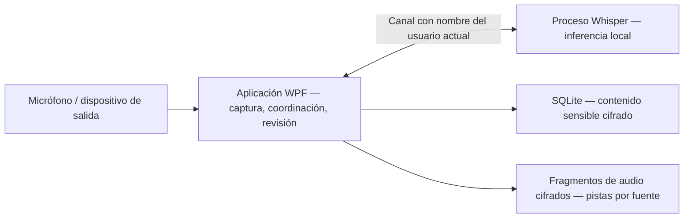

<p align="center">
  
</p>

# Trazio Asistente Reunión

**Conserva la conversación. El registro es tuyo.**

Un asistente de escritorio para Windows que captura el micrófono y el audio del equipo, transcribe localmente y convierte las reuniones guardadas en un espacio de revisión: escucha, navega, corrige y compara versiones de la transcripción sin sobrescribir el original.

**Windows 11 x64 · .NET 10 / C# 14 · Whisper local · Interfaz en español · Versión preliminar pública**

[Descargar v0.1.1-mvp](https://github.com/Andres-MMG/Trazio-Asistente-Reunion/releases/tag/v0.1.1-mvp) · [Primeros pasos](docs/user-guide.md) · [Arquitectura](docs/architecture.md) · [Hoja de ruta](ROADMAP.md) · [Documentación](docs/README.md)

> **MVP funcional avanzado — todavía no validado para producción.** Las etapas 5 (distribución) y 6 (calidad de revisión y retranscripción) están en curso. La etapa 5.5 (identidad local) está implementada, con validación física pendiente. Las pruebas de reuniones de dos y cinco horas siguen siendo requisitos de publicación pendientes. El paquete de Windows no está firmado.

## De la conversación en vivo a un registro revisable

```text
MICRÓFONO + AUDIO DEL EQUIPO
             ↓
    TRANSCRIPCIÓN LOCAL
             ↓
  AUDIO CIFRADO + HISTORIAL
             ↓
   ESCUCHAR → CORREGIR → COMPARAR
```

| Disponible ahora | Qué significa |
|---|---|
| Dos fuentes de audio diferenciadas | Selecciona un micrófono y/o un dispositivo de salida de Windows. Cada uno conserva su propia identidad de audio y transcripción. |
| Grabación manual rápida | Título automático editable; inicio, pausa, reanudación y detención; diagnóstico de captura visible. |
| Perfil local confirmado | Atribuye los segmentos del micrófono a un nombre elegido. Es una etiqueta, no identificación por voz. |
| Reconocimiento de voz local | Un proceso independiente de Whisper ejecuta la inferencia en este equipo. El modelo recomendado se descarga solo después de una acción explícita. |
| Historial de reuniones cifrado | Las nuevas grabaciones siempre conservan audio cifrado; el contenido de texto sensible se cifra antes de insertarse en SQLite. |
| Revisión humana | Forma de onda por fuente, línea de tiempo, saltos de 10 segundos, reproducción de segmentos, correcciones/deshacer y sugerencias de glosario por término, como `Need → Meet`. |
| Retranscripción no destructiva | Procesa el audio conservado en una nueva revisión del modelo; compara versiones por intervalos de 15 segundos y escucha la fuente correspondiente. |

**Todavía no implementado:** identificación de hablantes remotos, adaptadores de navegador/reuniones, automatización de calendarios, sincronización en la nube, resúmenes/traducción de reuniones, actualizaciones automáticas o entrenamiento de modelos. Las entradas del glosario se guardan, pero **todavía no se incorporan a Whisper ni se aplican automáticamente a nuevas transcripciones**. Una diferencia textual entre versiones no es una puntuación de precisión.

## Ejecutar la versión preliminar

1. Descarga el ZIP de Windows desde [Versiones publicadas](https://github.com/Andres-MMG/Trazio-Asistente-Reunion/releases/tag/v0.1.1-mvp) y extrae **el archivo completo**.
2. Abre `Trazio.AsistenteReunion.exe`. Mantén `Trazio.AsistenteReunion.Worker.exe` y todas las dependencias incluidas junto a él; copiar solo el EXE no funcionará.
3. Confirma tu nombre visible local, selecciona los dispositivos correctos y descarga el modelo recomendado desde la aplicación (aproximadamente 148 MB, una vez).
4. Haz clic en **Iniciar transcripción**. Usa **Detener** para finalizar antes de revisar la reunión en **Historial**.

El paquete incluye el entorno de ejecución de .NET. Se requiere una CPU x64 compatible. La definición del instalador opcional existe en el código fuente; la versión preliminar publicada es un ZIP. Consulta [primera grabación, reproducción, actualizaciones y solución de problemas](docs/user-guide.md).

> **Límite de grabación:** silenciarte en Meet, Teams o Zoom no silencia la captura independiente del micrófono de Trazio. Pausa Trazio cuando deba dejar de capturar. El audio del equipo abarca el dispositivo de salida seleccionado, no solo una pestaña de reunión. Obtén los permisos correspondientes antes de grabar.

## Arquitectura de un vistazo



| Capa | Tecnología |
|---|---|
| Escritorio | WPF, .NET 10, C# 14; interfaz en español |
| Captura / reproducción | NAudio 2.2.1, Windows WASAPI |
| Reconocimiento | Whisper.net + entorno de ejecución CPU 1.9.1; catálogo Whisper Base multilingüe |
| Persistencia | Microsoft.Data.Sqlite 10.0.4; contenido cifrado |
| Protección | AES-256-GCM; Windows DPAPI `CurrentUser` para la clave maestra y la configuración |
| Distribución / comprobaciones | Publicación y pruebas básicas con PowerShell, Inno Setup 6 opcional; pruebas xUnit |

La [guía de arquitectura](docs/architecture.md) vincula estas afirmaciones con archivos fuente, registra decisiones y límites, y explica los flujos de captura/recuperación/retranscripción. Esta aplicación es **independiente de Trazio Platforms**; no hay conexión con la plataforma en esta versión.

## Estado de ingeniería

| Línea de trabajo | Situación actual |
|---|---|
| Captura, cifrado, almacenamiento, historial | Bases implementadas; aceptación física y de larga duración todavía pendiente |
| Etapa 5 — distribución | Código público + ZIP versionado disponibles; firma, actualización/reversión automáticas y pruebas paralelas deterministas pendientes |
| Etapa 5.5 — identidad | Perfil local y atribución del micrófono implementados; sin reconocimiento de hablantes remotos |
| Etapa 6 — calidad | Revisión, reproducción por fuente, corrección, captura de glosario, retranscripción y comparación visual implementadas; evaluación de precisión y aplicación del glosario pendientes |
| Etapas posteriores | Atribución de fuente de reunión → productividad → inteligencia/integración opcionales → calendarios (11) → entrenamiento (12) |

La comprobación registrada de la versión aprobó **164/164 pruebas con el paralelismo entre colecciones desactivado**. La ejecución paralela predeterminada presenta bloqueos intermitentes durante la limpieza de SQLite. Es un problema conocido de aislamiento de pruebas, no una insignia de CI aprobada ni una prueba de estabilidad de cinco horas. Consulta [evidencia de validación y lista de aceptación](docs/validation.md).

## Privacidad, sin promesas mágicas

- El audio y la transcripción permanecen locales; no hay una alternativa de inferencia en la nube implementada.
- La **estructura y los metadatos operativos de SQLite no están completamente cifrados**; el contenido sensible sí.
- El audio nuevo se cifra en reposo y se reproduce dentro de la aplicación sin un WAV temporal en texto claro. Las exportaciones TXT/WAV explícitas no están cifradas.
- DPAPI vincula la clave al usuario de Windows. Copiar la carpeta de datos a otra cuenta **no** es una estrategia de respaldo/restauración portátil.
- El audio que nunca se conservó o que fue eliminado por retención no se puede recuperar a partir de su transcripción.

Lee el [modelo de amenazas y los límites de retención/recuperación](docs/security.md) antes de confiar reuniones sensibles a la beta.

## Compilar y contribuir

```powershell
dotnet restore .\Trazio.AsistenteReunion.slnx
dotnet build .\Trazio.AsistenteReunion.slnx -c Release --no-restore
.\installer\publish.ps1
```

La salida combinada admitida es `artifacts\publish`. Cierra la aplicación antes de volver a publicarla; el script reemplaza esa carpeta. Consulta [entorno de desarrollo, pruebas, comprobación de paquetes y reglas de contribución](docs/development.md).

## Licencia y agradecimientos

**Todavía no se ha seleccionado una licencia para el código fuente de la aplicación.** La visibilidad pública no otorga una licencia MIT. Las dependencias y los modelos tienen condiciones independientes; conserva los [avisos de terceros](THIRD-PARTY-NOTICES.md) al distribuir un paquete. No se incluye código fuente de FluidVoice/GPL.

---

**Primero la señal. Siempre la evidencia.** [Explorar la documentación de ingeniería →](docs/README.md)

¿Lees este README desde un ZIP extraído? La portada y los enlaces locales de documentación son recursos del repositorio; utiliza el [índice de documentación en línea](https://github.com/Andres-MMG/Trazio-Asistente-Reunion/tree/main/docs).