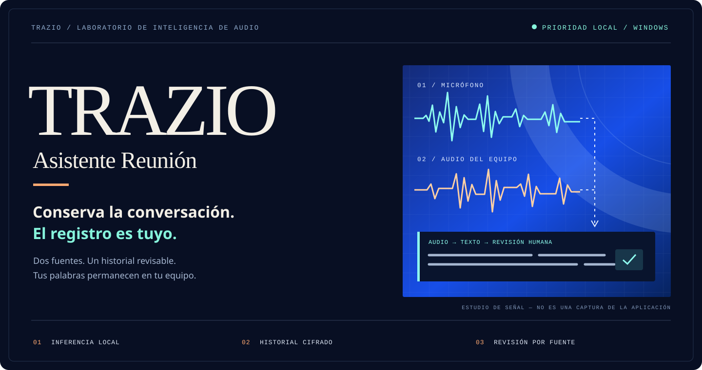
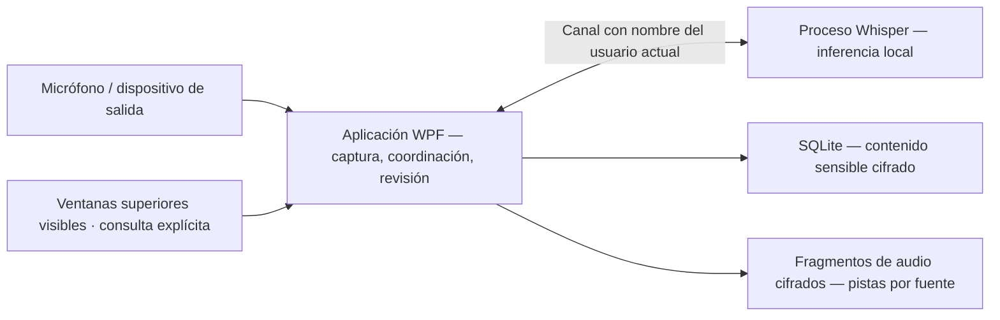

<p align="center">
  
</p>

# Trazio Asistente Reunión

**Conserva la conversación. El registro es tuyo.**

Un asistente de escritorio para Windows que captura el micrófono y el audio del equipo, transcribe localmente y convierte las reuniones guardadas en un espacio de revisión: escucha, navega, corrige y compara versiones de la transcripción sin sobrescribir el original.

**Windows 11 x64 · .NET 10 / C# 14 · Whisper local · Interfaz en español · Versión preliminar pública**

[Descargar v0.2.0-beta.9](https://github.com/Andres-MMG/Trazio-Asistente-Reunion/releases/tag/v0.2.0-beta.9) · [Primeros pasos](docs/user-guide.md) · [Arquitectura](docs/architecture.md) · [Hoja de ruta](ROADMAP.md) · [Documentación](docs/README.md)

> **Beta funcional publicada — todavía no validada para producción.** `v0.2.0-beta.9` es la descarga pública actual. Incluye la infraestructura 7.2b, el ensamblado compartido `VisualAnalysis`, el instalador manual offline por usuario, la revisión de historial 8.1, la búsqueda local 8.2 y la gestión global básica del diccionario 8.3a, pero no empaqueta la CLI `VisualEvaluation`, su corpus sintético, golden ni directorios de evaluación. Los perfiles de producción para Meet y Teams permanecen `Unvalidated`; el procesamiento se abstiene y la evidencia se muestra como **No disponible** tanto en vivo como en Historial. No existe identificación de hablantes ni una capacidad empaquetada nueva. La validación física audible, WGC/GPU, interfaz, accesibilidad, Meet/Teams reales y las pruebas de 2/5 horas siguen pendientes. El ZIP y el Setup publicados no están firmados.

> **Evidencia inmutable de `v0.2.0-beta.9`.** El tag resuelve al commit `8eb4c2e5a16ff34db21a34bb1ff91feb93de7375`. El ZIP oficial `Trazio-Asistente-Reunion-v0.2.0-beta.9-win-x64.zip` mide **86,876,029 bytes** y su SHA-256 es `64861c690b4f89dd9bf347fc970761c1c95be2bcc67a075ce24f6a0f63dca7bd`. El Setup oficial `Trazio-Asistente-Reunion-v0.2.0-beta.9-Setup.exe` mide **60,037,793 bytes**, su SHA-256 es `3bfd4ae6777f18d1a59b379ee6bd42c515d6e13481ed19774c2c16fb67988635` y Authenticode informa `NotSigned`. El manifiesto de publicación mide **123,576 bytes** y su SHA-256 es `2b96f0f7082211edeef65608815b74e6d7e9fff1e1189117dc25c305a4b403a6`; el manifiesto del Setup mide **486 bytes** y su SHA-256 es `2457b68fbe5e87eaf75d7ec51c3c02148cd18ddbf811cbb832108a07ade1b40d`. Tamaños y digest de los recursos remotos coinciden con los artefactos verificados y sus archivos laterales. La release es una prerelease pública.

> **Límite de validación.** La publicación remota y la integridad de ambos recursos están verificadas, pero el Setup con identidad productiva no se ejecutó. La cancelación humana, la validación en otra máquina o cuenta, la firma y las pruebas físicas siguen pendientes; no deben inferirse a partir del harness desechable.

> **Revisión de historial 8.1 vigente en beta 9.** Publicada originalmente en beta 7, incorpora navegación anterior/siguiente sin reproducción automática, línea de tiempo que conserva huecos, resaltado independiente y velocidades temporales `0,75×–2×` para pista, fragmento y comparación. El resampling cambia el tono y la velocidad vuelve a `1×` al reiniciar. La prueba audible con hardware real, teclado completo y lector de pantalla continúa pendiente.

> **Diccionario global 8.3a publicado en beta 9.** La tercera pestaña **Diccionario** permite listar, filtrar y activar/desactivar entradas globales cifradas. Activar una entrada solo la prepara para una aplicación futura: esta versión no aplica términos a Whisper ni reemplaza transcripciones. El paquete mantiene exactamente cinco capacidades. El instalador sigue `NotSigned`, el Setup productivo no se ha ejecutado y continúan pendientes la validación visual, por teclado, lector de pantalla y las pruebas físicas audibles, WGC/GPU, Meet/Teams y 2/5 horas.

> **Candidato `v0.2.0-beta.10` en `main` — todavía no publicado.** La fuente declara la secuencia de instalador **11** e incorpora 8.3b: intercambio JSON v1 con exportación explícita sin cifrar, importación con vista previa, aplicación atómica y detección conservadora de duplicados/conflictos. No fusiona ni elimina entradas automáticamente, no conserva la ruta del archivo y no cambia Whisper. La descarga pública vigente sigue siendo beta 9. El candidato aún no tiene tag, ZIP, Setup, tamaños ni SHA-256 definitivos.

## De la conversación en vivo a un registro revisable

```text
MICRÓFONO + AUDIO DEL EQUIPO
             ↓
    TRANSCRIPCIÓN LOCAL
             ↓
  AUDIO CIFRADO + HISTORIAL
             ↓
   ESCUCHAR → CORREGIR → COMPARAR
```

| Estado funcional documentado | Qué significa |
|---|---|
| Dos fuentes de audio diferenciadas | Selecciona un micrófono y/o un dispositivo de salida de Windows. Cada uno conserva su propia identidad de audio y transcripción. |
| Grabación manual rápida | Título automático editable; inicio, pausa, reanudación y detención; diagnóstico de captura visible. |
| Perfil local confirmado | Atribuye los segmentos del micrófono a un nombre elegido. Es una etiqueta, no identificación por voz. |
| Aplicación de reunión opcional | Después de una acción explícita, permite asociar una ventana superior visible y conservar solo `Google Meet`, `Microsoft Teams`, `Otra aplicación` o `Sin seleccionar`. Asociarla no activa por sí sola el análisis visual ni guarda el título, URL, proceso o identificador de ventana. |
| Captura y actividad visual anónima 7.2a/7.2b | La beta 9 publicada conserva la autorización de captura WGC de 7.2a y un consentimiento distinto y de un solo uso para análisis anónimo, extracción acotada de agregados D3D11 e intervalos cifrados de cobertura/actividad. Los perfiles de producción Meet/Teams permanecen `Unvalidated`, por lo que se abstiene y muestra **No disponible**. No conserva píxeles, imágenes o video ni identifica personas. |
| Reconocimiento de voz local | Un proceso independiente de Whisper ejecuta la inferencia en este equipo. El modelo recomendado se descarga solo después de una acción explícita. |
| Historial de reuniones cifrado | Las nuevas grabaciones siempre conservan audio cifrado; el contenido de texto sensible se cifra antes de insertarse en SQLite. |
| Revisión humana | Forma de onda por fuente, línea de tiempo que conserva huecos reales, saltos de 10 segundos, anterior/siguiente sin reproducción automática, resaltado del fragmento reproducido, correcciones/deshacer y sugerencias de glosario por término, como `Need → Meet`. |
| Velocidad de reproducción temporal | Permite `0,75×`, `1×`, `1,25×`, `1,5×` y `2×` para pista, fragmento e intervalo comparado. Se mantiene solo durante la ejecución; usa resampling y por eso cambia el tono. |
| Búsqueda local segura 8.2 | La beta 9 pública busca manualmente títulos y el texto efectivo de la transcripción original, ignorando mayúsculas y diacríticos. Descifra y compara en memoria sin FTS ni índice de texto plano; una corrección activa reemplaza el original y deshacerla lo restaura. |
| Diccionario global 8.3a | La beta 9 lista todas las entradas descifradas, filtra en memoria por términos/categoría y permite marcar cada duplicado histórico como activo o inactivo de forma independiente. Activar una entrada todavía no modifica Whisper ni las transcripciones. |
| Retranscripción no destructiva | Procesa el audio conservado en una nueva revisión del modelo; compara versiones por intervalos de 15 segundos y escucha la fuente correspondiente. |
| Exportación para Obsidian | Crea de forma explícita una nota Markdown en la carpeta elegida, con metadatos, marcas de tiempo, fuente, hablante y correcciones humanas vigentes; no exporta audio ni selecciona silenciosamente una revisión del modelo. |
| Instalación manual segura | La beta 9 publica un instalador offline por usuario con payloads versionados, reparación de la misma versión, bloqueo de downgrade y rollback durante Setup. El instalador permanece sin firma y no fue ejecutado con identidad productiva; no hay descarga ni actualización automática. |

Las funciones de revisión de la etapa 8.1, publicadas desde beta 7, continúan en la beta 9 pública. Su validación audible con hardware real, teclado completo y lector de pantalla continúa pendiente.

**Todavía no implementado:** identificación de hablantes remotos, perfiles de producción validados, OCR, reconocimiento de rostros, lectura de nombres, pestañas/DOM/URL, chat, subtítulos o documentos, adaptadores de proveedores, automatización de calendarios, sincronización en la nube, resúmenes/traducción de reuniones, actualizaciones automáticas o entrenamiento de modelos. La evidencia visual anónima solo se correlaciona con `SystemOutput`; no modifica la transcripción, `SpeakerName` ni las exportaciones TXT, Markdown u Obsidian. Las entradas del glosario se guardan, pero **todavía no se incorporan a Whisper ni se aplican automáticamente a nuevas transcripciones**. Una diferencia textual entre versiones no es una puntuación de precisión.

## Ejecutar la versión preliminar

1. Descarga el ZIP de Windows desde [v0.2.0-beta.9](https://github.com/Andres-MMG/Trazio-Asistente-Reunion/releases/tag/v0.2.0-beta.9), verifica el archivo lateral `.sha256` y extrae **el archivo completo**. El ZIP oficial mide **86,876,029 bytes** y su SHA-256 es `64861c690b4f89dd9bf347fc970761c1c95be2bcc67a075ce24f6a0f63dca7bd`.
2. Abre `Trazio.AsistenteReunion.exe`. Mantén `Trazio.AsistenteReunion.Worker.exe` y todas las dependencias incluidas junto a él; copiar solo el EXE no funcionará.
3. Confirma tu nombre visible local, selecciona los dispositivos correctos y, si quieres registrar el proveedor, asocia manualmente una ventana superior de reunión. La captura visual y el análisis anónimo requieren autorizaciones separadas; la segunda es de un solo uso y, con los perfiles de producción actuales, se abstiene y muestra **No disponible**. Descarga el modelo recomendado desde la aplicación (aproximadamente 148 MB, una vez).
4. Haz clic en **Iniciar transcripción**. Usa **Detener** para finalizar antes de revisar la reunión en **Historial**.

El paquete incluye el entorno de ejecución de .NET. Se requiere una CPU x64 compatible. La descarga pública actual ofrece el ZIP y el Setup de beta 9; verifica el recurso elegido contra su archivo lateral antes de usarlo. Consulta [primera grabación, reproducción, actualizaciones y solución de problemas](docs/user-guide.md).

> **Límite de grabación:** silenciarte en Meet, Teams o Zoom no silencia la captura independiente del micrófono de Trazio. Pausa Trazio cuando deba dejar de capturar. El audio del equipo abarca el dispositivo de salida seleccionado, no solo una pestaña de reunión. Obtén los permisos correspondientes antes de grabar.

## Arquitectura de un vistazo



| Capa | Tecnología |
|---|---|
| Escritorio | WPF, .NET 10, C# 14; interfaz en español |
| Captura / reproducción | NAudio 2.2.1, Windows WASAPI; Windows Graphics Capture efímero y sondeo agregado D3D11 acotado, con consentimientos separados. La lógica determinista compartida vive en `VisualAnalysis`; el evaluador offline no se distribuye. |
| Reconocimiento | Whisper.net + entorno de ejecución CPU 1.9.1; catálogo Whisper Base multilingüe |
| Persistencia | Microsoft.Data.Sqlite 10.0.4; contenido cifrado |
| Protección | AES-256-GCM; Windows DPAPI `CurrentUser` para la clave maestra y la configuración |
| Distribución / comprobaciones | Publicación y manifiesto determinista con PowerShell; instalador offline por usuario con Inno Setup 6; harness desechable; pruebas xUnit |

La [guía de arquitectura](docs/architecture.md) vincula estas afirmaciones con archivos fuente, registra decisiones y límites, y explica los flujos de captura/recuperación/retranscripción. Esta aplicación es **independiente de Trazio Platforms**; no hay conexión con la plataforma en esta versión.

## Estado de ingeniería

| Línea de trabajo | Situación actual |
|---|---|
| Captura, cifrado, almacenamiento, historial | Bases implementadas; aceptación física y de larga duración todavía pendiente |
| Etapa 5 — distribución | ZIP y Setup beta 9/secuencia 10 publicados con el instalador manual offline versionado. Incluye reparación, bloqueo de downgrade, rollback transaccional y manifiestos SHA-256; firma, ejecución productiva del Setup, cancelación humana y validación física en otra máquina o cuenta continúan pendientes |
| Etapa 5.5 — identidad | Perfil local y atribución del micrófono implementados; validación física de interfaz y captura pendiente |
| Etapa 6 — revisión | Línea base funcional implementada: reproducción por fuente/segmento, corrección, glosario cifrado con procedencia, retranscripción versionada, comparación y exportación manual a Obsidian |
| Etapa 8.1 — revisión del historial | Publicada desde beta 7 y vigente en beta 9: anterior/siguiente sobre filas cargadas, línea de tiempo sensible a huecos, resaltado independiente y velocidad temporal `0,75×–2×`. Reproducción real, tono, teclado y lector de pantalla aún requieren validación física |
| Etapa 8.2 — búsqueda local | Publicada desde beta 8 y vigente en beta 9: consulta explícita, cancelable y generacional sobre títulos y texto efectivo original/corregido; máximo 100 resultados visibles, sin FTS/índice persistente y sin reproducción automática. La validación física de interfaz/accesibilidad sigue pendiente |
| Etapa 8.3a — diccionario global | Publicada en beta 9: tercera pestaña, filtro local por términos/categoría y estado, máximo 120 filas visibles y activación por entrada. Activar todavía no modifica Whisper ni las transcripciones; la fusión destructiva, la aplicación del diccionario y la validación física siguen pendientes |
| Etapa 8.3b — intercambio del diccionario | Incluida en el candidato beta 10 de `main`, aún no publicado: JSON v1, vista previa, importación cifrada atómica, exportación explícita sin cifrar y avisos visuales de duplicados/conflictos sin fusión destructiva |
| Etapa 7 y posteriores | 7.1a, 7.2a y la infraestructura fuente de 7.2b están implementadas; 7.2b permanece inactiva en producción porque Meet/Teams siguen `Unvalidated`, y toda validación física continúa pendiente. La etapa 7 no está completa y no identifica hablantes → adaptadores 7.2c–7.2e → productividad/glosario avanzado (8) → inteligencia/integración opcionales → calendarios (11) → entrenamiento (12) |

La evidencia histórica de `v0.1.1-mvp` registró **164/164 pruebas**, `v0.2.0-beta.2` registró **197/197** en `a8481ef` y la base funcional de `v0.2.0-beta.3`, validada en `b075958`, registró **54/54 pruebas enfocadas de captura visual** y **250/250 pruebas seriales**. La versión publicada `v0.2.0-beta.4` completó **4/4 `VersionMetadataTests`**, **132/132 pruebas `Area=VisualCapture`**, **371/371 pruebas Release seriales** y **371/371 en paralelo predeterminado**, con compilación de **0 advertencias y 0 errores**; también aprobaron el contrato de publicación, la prueba básica por canal con nombre y la comparación del layout (**494/494 archivos byte a byte**, **0** hallazgos prohibidos, **0** rutas fuente locales y **0** referencias CodeView). El tag corresponde al commit `f871f20c3bf9e77b0cf9ad51134febb83c673de7`; el ZIP remoto de **86,823,005 bytes**, su digest SHA-256 y el archivo lateral publicado coinciden con el paquete verificado. Ninguna de estas comprobaciones demuestra WGC/GPU real, interfaz renderizada, lector de pantalla, Meet/Teams reales ni estabilidad de 2/5 horas. Consulta [evidencia de validación y lista de aceptación](docs/validation.md).

La versión publicada `v0.2.0-beta.5` completó **4/4 `VersionMetadataTests`**, **74/74 pruebas `VisualEvaluation`**, **206/206 pruebas `Area=VisualCapture`**, **446/446 pruebas Release seriales** y **446/446 en paralelo**, con compilación de **0 advertencias y 0 errores**; también aprobaron CLI `VE000 verified`, `publish` y smoke IPC integrado/explícito. El layout final coincidió **495/495** archivos byte a byte: `VisualAnalysis.dll` presente y versionada, evaluador/corpus/golden/`tools`/`evaluation` ausentes, exactamente cinco capacidades y **0** hallazgos prohibidos, rutas fuente locales o referencias CodeView. Esta evidencia automatizada y sintética no demuestra WGC/GPU real, interfaz, accesibilidad, Meet/Teams reales ni estabilidad de 2/5 horas.

Como evidencia histórica, la verificación de beta 6/secuencia 7 aprobó las pruebas enfocadas canónicas de versión/instalador/instancia **10/10**, el conjunto Release serial **451/451** y paralelo **451/451**, con compilación Release de **0 advertencias / 0 errores**; `VE000 verified`, `publish` y smoke IPC integrado y explícito también aprobaron. El layout final coincidió **495/495** rutas, hashes y contenido byte a byte; `ProductVersion` fue `0.2.0-beta.6+232caf92832e2d7ef53f2578c32a230ed9bcc2e7`; el harness desechable aprobó **14/14** escenarios, incluido rollback con código 5 de Inno Setup y limpieza.

Como evidencia histórica, beta 7/secuencia 8 aprobó Release serial y paralelo **520/520**, compilación Release sin advertencias ni errores y un layout **495/495** con `ProductVersion` `0.2.0-beta.7+25e3f36867250599ef5026d7270fc37af85a7c44`.

Como antecedente histórico, la verificación publicada de beta 8/secuencia 9 aprobó Release serial y paralelo **543/543**, el filtro enfocado de cinco clases **48/48**, los contratos finales **22/22**, el harness desechable **14/14** y el layout **495/495**. El filtro ampliado **61/61** se conserva únicamente como evidencia histórica de la búsqueda 8.2.

La verificación publicada de beta 9/secuencia 10 aprobó el conjunto completo Release serial y paralelo **574/574**, la suite enfocada de 8.3a **23/23**, los contratos finales **22/22** y el harness desechable **14/14**. El layout final coincidió **495/495**, `ProductVersion` fue `0.2.0-beta.9+8eb4c2e5a16ff34db21a34bb1ff91feb93de7375` y el manifiesto conservó exactamente cinco capacidades. La publicación remota confirmó tamaños y digest, pero el Setup productivo no se ejecutó. Los nombres, tamaños, SHA-256 y límites se registran fuera del payload en [la evidencia completa](docs/validation.md), para que el README incluido en el paquete no dependa del hash del propio paquete.

## Privacidad, sin promesas mágicas

- El audio y la transcripción permanecen locales; no hay una alternativa de inferencia en la nube implementada.
- La **estructura y los metadatos operativos de SQLite no están completamente cifrados**; el contenido sensible sí. El proveedor normalizado de una ventana asociada es un metadato visible.
- El título y la aplicación existen únicamente dentro del selector y se descartan al asociar o cerrar. Fuera del modal solo permanecen temporalmente HWND, PID y proveedor; la sesión persiste únicamente el proveedor normalizado.
- La captura visual 7.2a y el análisis anónimo 7.2b permanecen desactivados hasta sus autorizaciones separadas; la segunda es de un solo uso. Los fotogramas/superficies se liberan después de extraer agregados acotados y no se conservan píxeles, imágenes o video. Solo pueden persistir cifrados intervalos derivados de cobertura/actividad.
- La presentación visual de segmentos falla de forma segura: solo `SystemOutput` puede mostrar evidencia; micrófono, `SpeakerName`, transcripción y exportaciones TXT/Markdown/Obsidian permanecen sin cambios. Con los perfiles de producción actuales, el resultado es **No disponible**, no una identidad inferida.
- El audio nuevo se cifra en reposo y se reproduce dentro de la aplicación sin un WAV temporal en texto claro. Las exportaciones TXT/Markdown/WAV explícitas no están cifradas.
- DPAPI vincula la clave al usuario de Windows. Copiar la carpeta de datos a otra cuenta **no** es una estrategia de respaldo/restauración portátil.
- El audio que nunca se conservó o que fue eliminado por retención no se puede recuperar a partir de su transcripción.

Lee el [modelo de amenazas y los límites de retención/recuperación](docs/security.md) antes de confiar reuniones sensibles a la beta.

## Compilar y contribuir

```powershell
dotnet restore .\Trazio.AsistenteReunion.slnx
dotnet build .\Trazio.AsistenteReunion.slnx -c Release --no-restore
.\installer\publish.ps1
pwsh -NoProfile -File .\installer\package-portable.ps1
.\installer\build-installer.ps1
```

La salida combinada admitida es `artifacts\publish`. Cierra la aplicación antes de volver a publicarla; el script reemplaza esa carpeta. El empaquetador portable exige el payload y manifiesto canónicos, verifica cada entrada y genera el ZIP con orden, fecha y rutas normalizados, más su sidecar SHA-256. La identidad byte a byte se garantiza para el mismo payload bajo la misma compilación exacta de PowerShell/.NET, no entre runtimes distintos. El constructor productivo vuelve a ejecutar `publish.ps1` y genera el instalador en `artifacts\installer`. El `.exe` permanece sin firma; sus archivos `.sha256` y `.manifest.json` prueban integridad local, no identidad del editor. No se afirma que dos compilaciones de Inno Setup produzcan un `.exe` idéntico byte a byte. Consulta [entorno de desarrollo, pruebas, comprobación de paquetes y reglas de contribución](docs/development.md).

## Licencia y agradecimientos

**Todavía no se ha seleccionado una licencia para el código fuente de la aplicación.** La visibilidad pública no otorga una licencia MIT. Las dependencias y los modelos tienen condiciones independientes; conserva los [avisos de terceros](THIRD-PARTY-NOTICES.md) al distribuir un paquete. No se incluye código fuente de FluidVoice/GPL.

---

**Primero la señal. Siempre la evidencia.** [Explorar la documentación de ingeniería →](docs/README.md)

¿Lees este README desde un ZIP extraído? La portada y los enlaces locales de documentación son recursos del repositorio; utiliza el [índice de documentación en línea](https://github.com/Andres-MMG/Trazio-Asistente-Reunion/tree/main/docs).
