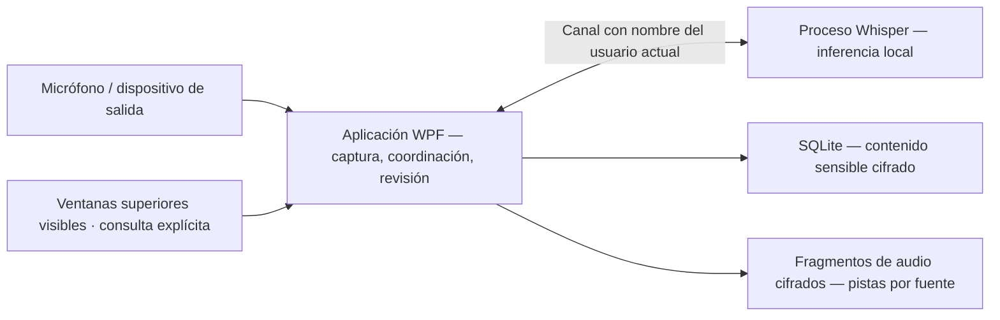

<p align="center">
  
</p>

# Trazio Asistente Reunión

**Conserva la conversación. El registro es tuyo.**

Un asistente de escritorio para Windows que captura el micrófono y el audio del equipo, transcribe localmente y convierte las reuniones guardadas en un espacio de revisión: escucha, navega, corrige y compara versiones de la transcripción sin sobrescribir el original.

**Windows 11 x64 · .NET 10 / C# 14 · Whisper local · Interfaz en español · Versión preliminar pública**

[Descargar v0.2.0-beta.3](https://github.com/Andres-MMG/Trazio-Asistente-Reunion/releases/tag/v0.2.0-beta.3) · [Primeros pasos](docs/user-guide.md) · [Arquitectura](docs/architecture.md) · [Hoja de ruta](ROADMAP.md) · [Documentación](docs/README.md)

> **Beta funcional publicada — todavía no validada para producción.** `v0.2.0-beta.3` sigue siendo la descarga pública actual. El candidato fuente local `v0.2.0-beta.4` agrega la implementación de 7.2b: una autorización adicional de un solo uso activa una infraestructura acotada de sondeo WGC/D3D11 que solo produce agregados anónimos y conserva cifrados intervalos derivados de cobertura/actividad. Los perfiles de producción para Meet y Teams permanecen `Unvalidated`; el procesamiento se abstiene y la evidencia se muestra como **No disponible** tanto en vivo como en Historial. No existe identificación de hablantes. La validación física de WGC/GPU, accesibilidad, Meet/Teams reales y las pruebas de 2/5 horas siguen pendientes. El paquete publicado no está firmado.

## De la conversación en vivo a un registro revisable

```text
MICRÓFONO + AUDIO DEL EQUIPO
             ↓
    TRANSCRIPCIÓN LOCAL
             ↓
  AUDIO CIFRADO + HISTORIAL
             ↓
   ESCUCHAR → CORREGIR → COMPARAR
```

| Disponible ahora | Qué significa |
|---|---|
| Dos fuentes de audio diferenciadas | Selecciona un micrófono y/o un dispositivo de salida de Windows. Cada uno conserva su propia identidad de audio y transcripción. |
| Grabación manual rápida | Título automático editable; inicio, pausa, reanudación y detención; diagnóstico de captura visible. |
| Perfil local confirmado | Atribuye los segmentos del micrófono a un nombre elegido. Es una etiqueta, no identificación por voz. |
| Aplicación de reunión opcional | Después de una acción explícita, permite asociar una ventana superior visible y conservar solo `Google Meet`, `Microsoft Teams`, `Otra aplicación` o `Sin seleccionar`. Asociarla no activa por sí sola el análisis visual ni guarda el título, URL, proceso o identificador de ventana. |
| Captura y actividad visual anónima 7.2a/7.2b | La beta 3 publicada incluye la autorización de captura WGC de 7.2a. El candidato fuente beta 4 agrega un consentimiento distinto y de un solo uso para análisis anónimo, extracción acotada de agregados D3D11 e intervalos cifrados de cobertura/actividad. Los perfiles de producción Meet/Teams permanecen `Unvalidated`, por lo que se abstiene y muestra **No disponible**. No conserva píxeles, imágenes o video ni identifica personas. |
| Reconocimiento de voz local | Un proceso independiente de Whisper ejecuta la inferencia en este equipo. El modelo recomendado se descarga solo después de una acción explícita. |
| Historial de reuniones cifrado | Las nuevas grabaciones siempre conservan audio cifrado; el contenido de texto sensible se cifra antes de insertarse en SQLite. |
| Revisión humana | Forma de onda por fuente, línea de tiempo, saltos de 10 segundos, reproducción de segmentos, correcciones/deshacer y sugerencias de glosario por término, como `Need → Meet`. |
| Retranscripción no destructiva | Procesa el audio conservado en una nueva revisión del modelo; compara versiones por intervalos de 15 segundos y escucha la fuente correspondiente. |
| Exportación para Obsidian | Crea de forma explícita una nota Markdown en la carpeta elegida, con metadatos, marcas de tiempo, fuente, hablante y correcciones humanas vigentes; no exporta audio ni selecciona silenciosamente una revisión del modelo. |

**Todavía no implementado:** identificación de hablantes remotos, perfiles de producción validados, OCR, reconocimiento de rostros, lectura de nombres, pestañas/DOM/URL, chat, subtítulos o documentos, adaptadores de proveedores, automatización de calendarios, sincronización en la nube, resúmenes/traducción de reuniones, actualizaciones automáticas o entrenamiento de modelos. La evidencia visual anónima solo se correlaciona con `SystemOutput`; no modifica la transcripción, `SpeakerName` ni las exportaciones TXT, Markdown u Obsidian. Las entradas del glosario se guardan, pero **todavía no se incorporan a Whisper ni se aplican automáticamente a nuevas transcripciones**. Una diferencia textual entre versiones no es una puntuación de precisión.

## Ejecutar la versión preliminar

1. Descarga el ZIP de Windows desde [Versiones publicadas](https://github.com/Andres-MMG/Trazio-Asistente-Reunion/releases/tag/v0.2.0-beta.3) y extrae **el archivo completo**.
2. Abre `Trazio.AsistenteReunion.exe`. Mantén `Trazio.AsistenteReunion.Worker.exe` y todas las dependencias incluidas junto a él; copiar solo el EXE no funcionará.
3. Confirma tu nombre visible local, selecciona los dispositivos correctos y, si quieres registrar el proveedor, asocia manualmente una ventana superior de reunión. La beta 3 publicada permite autorizar la captura visual por separado. El candidato fuente beta 4 agrega una segunda autorización para análisis anónimo; esa función todavía no forma parte de la descarga pública. Descarga el modelo recomendado desde la aplicación (aproximadamente 148 MB, una vez).
4. Haz clic en **Iniciar transcripción**. Usa **Detener** para finalizar antes de revisar la reunión en **Historial**.

El paquete incluye el entorno de ejecución de .NET. Se requiere una CPU x64 compatible. La definición del instalador opcional existe en el código fuente; la versión preliminar publicada es un ZIP. Consulta [primera grabación, reproducción, actualizaciones y solución de problemas](docs/user-guide.md).

> **Límite de grabación:** silenciarte en Meet, Teams o Zoom no silencia la captura independiente del micrófono de Trazio. Pausa Trazio cuando deba dejar de capturar. El audio del equipo abarca el dispositivo de salida seleccionado, no solo una pestaña de reunión. Obtén los permisos correspondientes antes de grabar.

## Arquitectura de un vistazo



| Capa | Tecnología |
|---|---|
| Escritorio | WPF, .NET 10, C# 14; interfaz en español |
| Captura / reproducción | NAudio 2.2.1, Windows WASAPI; Windows Graphics Capture efímero y sondeo agregado D3D11 acotado, con consentimientos separados |
| Reconocimiento | Whisper.net + entorno de ejecución CPU 1.9.1; catálogo Whisper Base multilingüe |
| Persistencia | Microsoft.Data.Sqlite 10.0.4; contenido cifrado |
| Protección | AES-256-GCM; Windows DPAPI `CurrentUser` para la clave maestra y la configuración |
| Distribución / comprobaciones | Publicación y pruebas básicas con PowerShell, Inno Setup 6 opcional; pruebas xUnit |

La [guía de arquitectura](docs/architecture.md) vincula estas afirmaciones con archivos fuente, registra decisiones y límites, y explica los flujos de captura/recuperación/retranscripción. Esta aplicación es **independiente de Trazio Platforms**; no hay conexión con la plataforma en esta versión.

## Estado de ingeniería

| Línea de trabajo | Situación actual |
|---|---|
| Captura, cifrado, almacenamiento, historial | Bases implementadas; aceptación física y de larga duración todavía pendiente |
| Etapa 5 — distribución | Código público y ZIP beta 3 disponibles; el candidato beta 4 fue verificado localmente, pero su ZIP/hash/tag/publicación finales siguen pendientes; firma y actualización/reversión automáticas continúan pendientes |
| Etapa 5.5 — identidad | Perfil local y atribución del micrófono implementados; validación física de interfaz y captura pendiente |
| Etapa 6 — revisión | Línea base funcional implementada: reproducción por fuente/segmento, corrección, glosario cifrado con procedencia, retranscripción versionada, comparación y exportación manual a Obsidian |
| Etapa 7 y posteriores | 7.1a, 7.2a y la infraestructura fuente de 7.2b están implementadas; 7.2b permanece inactiva en producción porque Meet/Teams siguen `Unvalidated`, y toda validación física continúa pendiente. La etapa 7 no está completa y no identifica hablantes → adaptadores 7.2c–7.2e → productividad/glosario avanzado (8) → inteligencia/integración opcionales → calendarios (11) → entrenamiento (12) |

La evidencia histórica de `v0.1.1-mvp` registró **164/164 pruebas** y `v0.2.0-beta.2` registró **197/197** en `a8481ef`. La base funcional de `v0.2.0-beta.3`, validada en `b075958`, registra **54/54 pruebas enfocadas de captura visual**, **250/250 pruebas seriales** y compilación Release sin errores ni advertencias. El candidato local `v0.2.0-beta.4` completó **4/4 `VersionMetadataTests`**, **132/132 pruebas `Area=VisualCapture`**, **371/371 pruebas Release seriales** y **371/371 en paralelo predeterminado**, con compilación de **0 advertencias y 0 errores**; también aprobaron el contrato de publicación, la prueba básica por canal con nombre y la comparación del layout candidato (**494/494 archivos byte a byte**, **0** hallazgos prohibidos y **0** rutas fuente locales). Esta es evidencia del candidato local, no de una versión publicada. El ZIP, tamaño, SHA-256, tag y release finales de beta 4 siguen pendientes porque el paquete debe reconstruirse después del commit de preparación para incorporar sus metadatos definitivos. Ninguna de estas comprobaciones demuestra WGC/GPU real, interfaz renderizada, lector de pantalla, Meet/Teams reales ni estabilidad de 2/5 horas. Consulta [evidencia de validación y lista de aceptación](docs/validation.md).

## Privacidad, sin promesas mágicas

- El audio y la transcripción permanecen locales; no hay una alternativa de inferencia en la nube implementada.
- La **estructura y los metadatos operativos de SQLite no están completamente cifrados**; el contenido sensible sí. El proveedor normalizado de una ventana asociada es un metadato visible.
- El título y la aplicación existen únicamente dentro del selector y se descartan al asociar o cerrar. Fuera del modal solo permanecen temporalmente HWND, PID y proveedor; la sesión persiste únicamente el proveedor normalizado.
- La captura visual 7.2a y el análisis anónimo 7.2b permanecen desactivados hasta sus autorizaciones separadas; la segunda es de un solo uso. Los fotogramas/superficies se liberan después de extraer agregados acotados y no se conservan píxeles, imágenes o video. Solo pueden persistir cifrados intervalos derivados de cobertura/actividad.
- La presentación visual de segmentos falla de forma segura: solo `SystemOutput` puede mostrar evidencia; micrófono, `SpeakerName`, transcripción y exportaciones TXT/Markdown/Obsidian permanecen sin cambios. Con los perfiles de producción actuales, el resultado es **No disponible**, no una identidad inferida.
- El audio nuevo se cifra en reposo y se reproduce dentro de la aplicación sin un WAV temporal en texto claro. Las exportaciones TXT/Markdown/WAV explícitas no están cifradas.
- DPAPI vincula la clave al usuario de Windows. Copiar la carpeta de datos a otra cuenta **no** es una estrategia de respaldo/restauración portátil.
- El audio que nunca se conservó o que fue eliminado por retención no se puede recuperar a partir de su transcripción.

Lee el [modelo de amenazas y los límites de retención/recuperación](docs/security.md) antes de confiar reuniones sensibles a la beta.

## Compilar y contribuir

```powershell
dotnet restore .\Trazio.AsistenteReunion.slnx
dotnet build .\Trazio.AsistenteReunion.slnx -c Release --no-restore
.\installer\publish.ps1
```

La salida combinada admitida es `artifacts\publish`. Cierra la aplicación antes de volver a publicarla; el script reemplaza esa carpeta. Consulta [entorno de desarrollo, pruebas, comprobación de paquetes y reglas de contribución](docs/development.md).

## Licencia y agradecimientos

**Todavía no se ha seleccionado una licencia para el código fuente de la aplicación.** La visibilidad pública no otorga una licencia MIT. Las dependencias y los modelos tienen condiciones independientes; conserva los [avisos de terceros](THIRD-PARTY-NOTICES.md) al distribuir un paquete. No se incluye código fuente de FluidVoice/GPL.

---

**Primero la señal. Siempre la evidencia.** [Explorar la documentación de ingeniería →](docs/README.md)

¿Lees este README desde un ZIP extraído? La portada y los enlaces locales de documentación son recursos del repositorio; utiliza el [índice de documentación en línea](https://github.com/Andres-MMG/Trazio-Asistente-Reunion/tree/main/docs).
