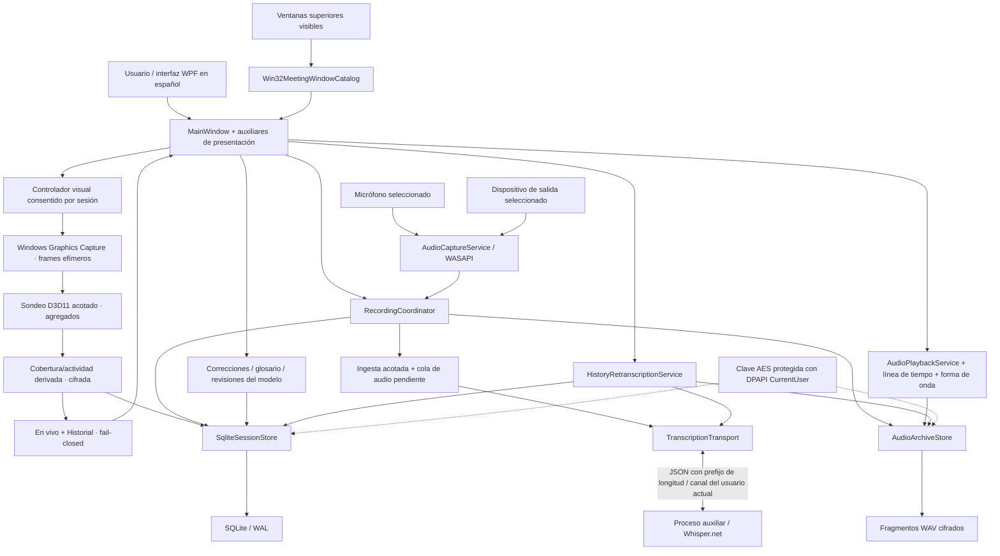
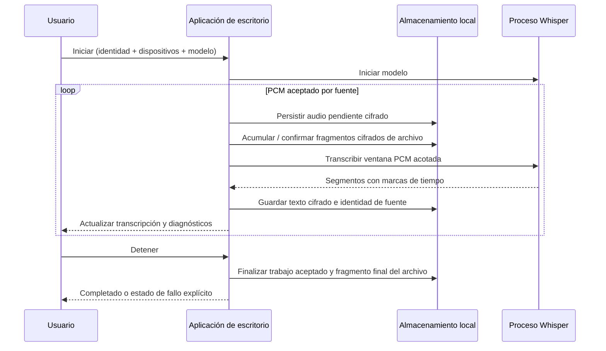

# Arquitectura — un flujo local de grabación y revisión

**La aplicación de escritorio controla captura, coordinación, revisión y almacenamiento. Un proceso local independiente controla la inferencia de voz.** El entorno de ejecución actual no requiere servidor web, extensión de navegador, servicio de servidor en la nube, cliente de calendario ni LLM externo.

La versión pública actual `0.2.0-beta.5` separa la lógica determinista en el ensamblado puro y sin paquetes `VisualAnalysis`, incluido y versionado en el layout final, y deja la CLI offline `VisualEvaluation`, el corpus sintético agregado y el golden canónico fuera del paquete. La verificación independiente aprobó metadatos **4/4**, evaluación visual **74/74**, captura visual **206/206**, Release serial/paralelo **446/446**, compilación limpia, CLI `VE000`, `publish` y smoke IPC integrado/explícito; el layout coincidió **495/495** con cinco capacidades y cero hallazgos prohibidos, rutas locales o CodeView. El tag resuelve a `5f16631747dd7f7a7f68d49ba0ca9cbd659f2733`; el ZIP publicado mide **86,829,207 bytes** y su SHA-256 es `0031cab096013b7bb436221a75d874719cc1d47ed03ac4047000b4e3094ddbdf`, coincidente con GitHub y el archivo lateral. Los perfiles de producción para Google Meet y Microsoft Teams permanecen `Unvalidated`, por lo que el detector se abstiene y la interfaz presenta **No disponible**. No existe identificación de hablantes ni una nueva capacidad empaquetada; siguen pendientes validación física WGC/GPU/interfaz/accesibilidad/Meet/Teams/2 h/5 h y firma.

## Mapa de componentes

| Proyecto | Responsabilidad | Puntos de entrada importantes |
|---|---|---|
| `Trazio.AsistenteReunion.App` | Interfaz WPF, audio de Windows, ciclo de vida de sesión, captura visual efímera consentida, sondeo agregado 7.2b y presentación fail-closed en vivo/Historial | [App.xaml.cs](../src/Trazio.AsistenteReunion.App/App.xaml.cs), [MainWindow.xaml.cs](../src/Trazio.AsistenteReunion.App/MainWindow.xaml.cs), [RecordingCoordinator.cs](../src/Trazio.AsistenteReunion.App/RecordingCoordinator.cs), [MeetingWindowSelection.cs](../src/Trazio.AsistenteReunion.App/MeetingWindowSelection.cs), [VisualCaptureSessionController.cs](../src/Trazio.AsistenteReunion.App/VisualCaptureSessionController.cs), [AnonymousVisualAnalysis.cs](../src/Trazio.AsistenteReunion.App/AnonymousVisualAnalysis.cs), [AnonymousVisualEvidencePresentation.cs](../src/Trazio.AsistenteReunion.App/AnonymousVisualEvidencePresentation.cs) |
| `Trazio.AsistenteReunion.Core` | Registros de dominio, cifrado, persistencia, traslado de almacenamiento, catálogo de modelos, recuperación, IPC y marcadores de proceso | [Domain.cs](../src/Trazio.AsistenteReunion.Core/Domain.cs), [SqliteSessionStore.cs](../src/Trazio.AsistenteReunion.Core/SqliteSessionStore.cs), [StorageLocation.cs](../src/Trazio.AsistenteReunion.Core/StorageLocation.cs), [ApplicationRunningMarker.cs](../src/Trazio.AsistenteReunion.Core/ApplicationRunningMarker.cs) |
| `Trazio.AsistenteReunion.VisualAnalysis` | Biblioteca `net10.0` pura, sin paquetes ni dependencias de plataforma, para detección determinista y contratos visuales anónimos compartidos; su DLL se distribuye con App/Core | [Detector](../src/Trazio.AsistenteReunion.VisualAnalysis/DeterministicVisualActivityDetector.cs), [contratos](../src/Trazio.AsistenteReunion.VisualAnalysis/VisualDomainContracts.cs), [proyecto](../src/Trazio.AsistenteReunion.VisualAnalysis/Trazio.AsistenteReunion.VisualAnalysis.csproj) |
| `Trazio.AsistenteReunion.Worker` | Cargar un modelo local, inferir segmentos transcritos y responder solicitudes acotadas por canal | [Program.cs](../src/Trazio.AsistenteReunion.Worker/Program.cs) |
| `Trazio.AsistenteReunion.VisualEvaluation` | CLI offline de desarrollo para evaluar el corpus sintético agregado y comparar el informe golden; no se referencia desde App ni se empaqueta | [Proyecto](../tools/Trazio.AsistenteReunion.VisualEvaluation/Trazio.AsistenteReunion.VisualEvaluation.csproj), [contrato del corpus](../evaluation/stage-7b/README.md) |
| `Trazio.AsistenteReunion.Tests` | Comprobaciones unitarias/de integración para contratos y rutas de fallo | [Proyecto de pruebas](../tests/Trazio.AsistenteReunion.Tests/Trazio.AsistenteReunion.Tests.csproj) |

App hace referencia a Core y VisualAnalysis; Worker hace referencia a Core; Core también comparte contratos de VisualAnalysis. VisualEvaluation solo hace referencia a VisualAnalysis y App no hace referencia al evaluador. VisualAnalysis no tiene paquetes ni referencias de proyecto. Ninguna biblioteca hace referencia a los ejecutables. La interfaz utiliza código asociado a WPF con servicios/auxiliares de presentación extraídos; **no** es una implementación completa de MVVM ni de arquitectura hexagonal.

### Límite de selección de ventana

[MeetingWindowSelection](../src/Trazio.AsistenteReunion.App/MeetingWindowSelection.cs) separa clasificación, estado de presentación y el límite Win32. El catálogo enumera ventanas superiores visibles solo al pulsar **Actualizar lista**; excluye la propia aplicación, títulos vacíos, tool windows y ventanas cloaked. El acceso al nombre del proceso puede fallar sin descartar el candidato.

El candidato mostrado dentro del modal contiene temporalmente HWND, PID, título y nombre de proceso. Al asociar, el título y el proceso se descartan: el controlador conserva solo HWND, PID y proveedor. Antes de iniciar, `IsWindow` y PID deben seguir correspondiendo; cualquier excepción se trata como pérdida sin propagarse. Durante la grabación un temporizador de tres segundos detecta pérdida sin reasignar otra ventana ni detener audio. Toda transición terminal consume la asociación. [SqliteSessionStore](../src/Trazio.AsistenteReunion.Core/SqliteSessionStore.cs) recibe únicamente `MeetingProvider`: `NotSelected`, `GoogleMeet`, `MicrosoftTeams` u `Other`.

Esta asociación no es captura por proceso. WASAPI sigue grabando el dispositivo de salida completo; asociar la ventana no activa WGC ni inspecciona pestañas, URL, DOM, subtítulos o hablantes.

### Límite visual efímero 7.2a y evidencia anónima 7.2b

La autorización de captura visual 7.2a es una acción distinta y no persistida, ligada a la selección HWND/PID exacta y consumida por la sesión de audio activa. [VisualCaptureSessionController](../src/Trazio.AsistenteReunion.App/VisualCaptureSessionController.cs) serializa inicio, pausa, reanudación, detención y disposición; callbacks antiguos se rechazan por identidad/revisión. [WindowsGraphicsCaptureService](../src/Trazio.AsistenteReunion.App/WindowsGraphicsCaptureService.cs) revalida el objetivo antes de `CreateForWindow`, usa un frame pool de dos buffers BGRA8 y entrega referencias temporales que se liberan dentro del ciclo de vida del frame.

7.2b exige una **segunda autorización**, separada de seleccionar la ventana y de autorizar WGC. [AnonymousVisualAnalysisAuthorization](../src/Trazio.AsistenteReunion.App/AnonymousVisualAnalysis.cs) es de un solo uso, versión 1 y queda ligada a la selección, sesión y alcance exactos. La activación también exige captura de `SystemOutput`; nunca proyecta evidencia sobre segmentos de micrófono.

[VisualProbeSession](../src/Trazio.AsistenteReunion.App/VisualProbeSession.cs) muestrea a frecuencia acotada, mantiene una sola observación pendiente y usa una canalización de eventos limitada. Para perfiles `Validated`, [D3D11VisualProbeExtractor](../src/Trazio.AsistenteReunion.App/D3D11VisualProbeExtractor.cs) copia únicamente parches de 16 × 16 a un atlas de staging acotado y devuelve agregados numéricos de coincidencia, contenido no negro y luminancia media; no serializa ni retiene píxeles. El detector determinista aplica política versionada, histéresis y coherencia para producir intervalos anónimos de cobertura/actividad. Los perfiles de producción [VisualProbeProfiles](../src/Trazio.AsistenteReunion.App/VisualProbeProfiles.cs) de Meet y Teams están `Unvalidated`, sin parches ni política: la sesión registra indisponibilidad y se abstiene antes de leer superficies.

[SqliteSessionStore](../src/Trazio.AsistenteReunion.Core/SqliteVisualEvidenceStore.cs) cifra el payload completo de cada intervalo derivado con AES-256-GCM y datos asociados por sesión/ID; la FK elimina la evidencia con la sesión. [AnonymousVisualEvidenceProjector](../src/Trazio.AsistenteReunion.App/AnonymousVisualEvidencePresentation.cs) mantiene instantáneas separadas para sesión activa e Historial y falla de forma segura ante evidencia ausente, corrupta, no compatible o sin política validada: muestra **No disponible**. La etiqueta explica que es actividad visual anónima; no escribe `SpeakerName`, no identifica personas y no modifica transcripción ni exportaciones TXT/Markdown/Obsidian.

El límite excluye OCR, rostros, nombres, chat, subtítulos y documentos. La retención de píxeles, imágenes y video es cero; solo persisten intervalos derivados cifrados. Cualquier fallo visual queda fuera de `RecordingCoordinator`, por lo que audio y transcripción continúan. Falta validar físicamente WGC/GPU, accesibilidad, Meet/Teams reales y sesiones de 2/5 horas.

El corpus de evaluación contiene solo observaciones agregadas sintéticas y su golden canónico. Se procesa mediante una CLI offline no distribuida; no activa WGC, no accede a una reunión real y no habilita perfiles de producción. El contrato de publicación incluye `VisualAnalysis.dll`, pero rechaza los artefactos de `VisualEvaluation`, el corpus/golden y directorios `tools`/`evaluation` en cualquier nivel.

## Límite de distribución y actualización manual

La instalación no forma parte de la raíz de datos. La raíz estable de programa es `%LOCALAPPDATA%\Programs\Trazio Asistente Reunion`; cada payload completo vive debajo de `versions\<versión>`. Inno Setup conserva un único AppId productivo y un registro monotónico de versión/secuencia. La activación ocurre mediante accesos directos y `ActivePayload`, después de copiar el candidato dentro de la transacción de Setup. El log de desinstalación se anexa en la raíz estable para retirar todos los payloads administrados sin declarar reglas sobre los datos.

[ApplicationRunningMarker](../src/Trazio.AsistenteReunion.Core/ApplicationRunningMarker.cs) abre `Trazio.AsistenteReunion.AppRunning.v1` tanto en App como en Worker durante toda su vida. Es un indicador para `AppMutex`; no sustituye el named pipe por usuario de [SingleInstanceGuard](../src/Trazio.AsistenteReunion.Core/SingleInstanceGuard.cs). El instalador configura `CloseApplications=no`, `RestartApplications=no` y `RestartIfNeededByRun=no`: si App o Worker están activos durante el chequeo de inicio, bloquea y pide cerrarlos normalmente; nunca fuerza el cierre ni reinicia una grabación. Existe una carrera conocida: App/Worker no adquieren `SetupMutex` y podrían iniciarse después de ese chequeo. Por eso el usuario debe mantener Trazio cerrado hasta que Setup termine; los payloads versionados reducen el riesgo de sobrescritura, pero no convierten ese chequeo en exclusión mutua completa.

`Directory.Build.props` define la versión y una secuencia monotónica. El estado moderno exige ambos valores y un mapeo explícito coherente: ausencia parcial, secuencia cero, contradicción o versión desconocida fallan antes de copiar. Solo si no existe estado moderno se consulta la versión legacy. La misma secuencia es reparación; una instalada menor permite actualización y una mayor rechaza downgrade. [publish.ps1](../installer/publish.ps1) produce el manifiesto determinista del payload. [build-installer.ps1](../installer/build-installer.ps1) productivo vuelve a publicar y solo acepta payload/salida/identidades canónicos; sus overrides quedan reservados a un workspace de prueba completamente desechable. Genera y vuelve a validar todos los campos de los sidecars, sin prometer que el `.exe` de Inno Setup sea reproducible byte a byte. [test-installer.ps1](../installer/test-installer.ps1) usa identidades completamente desechables.

El rollback termina al completar Setup. Conservar un payload anterior evita sobrescribir el ejecutable en uso y permite revertir una transacción fallida, pero **no** promete compatibilidad del esquema después del primer arranque de una versión nueva. No existe descarga automática, servicio de actualización, firma Authenticode ni limpieza automática de versiones antiguas.

## Captura y procesamiento duradero

- [AudioCaptureService](../src/Trazio.AsistenteReunion.App/AudioCaptureService.cs) normaliza las entradas seleccionadas a **16 kHz, mono, PCM16**. La captura del dispositivo de salida incluye otros sonidos reproducidos por ese dispositivo.
- [RecordingCoordinator](../src/Trazio.AsistenteReunion.App/RecordingCoordinator.cs) utiliza un canal de ingesta acotado a 10 elementos y luego una [cola pendiente](../src/Trazio.AsistenteReunion.Core/PendingQueue.cs) con límites predeterminados de cinco minutos por fuente y 64 MiB entre PCM en cola/asignado. Agotar la capacidad pausa visiblemente en lugar de permitir crecimiento sin límite.
- El reconocimiento en vivo procesa ventanas de 15 segundos con un segundo de arrastre. El archivo agrupa independientemente un máximo de 30 segundos por fuente. Son **límites distintos**, por lo que la división de segmentos en vivo y retranscritos puede diferir.
- [TranscriptionTransport](../src/Trazio.AsistenteReunion.App/TranscriptionTransport.cs) se comunica con un proceso hijo. El [encuadre IPC](../src/Trazio.AsistenteReunion.Core/Ipc.cs) utiliza longitudes de cuatro bytes little-endian y JSON, con un máximo de 32 MiB por mensaje. Los comandos son `health`, `start`, `transcribe` y `stop`; no es una API HTTP.
- Se intenta un reinicio del proceso auxiliar después de un fallo de proceso/canal. Un segundo fallo pausa la transcripción. Un fallo de dispositivo también pausa; ningún dispositivo se sustituye silenciosamente.
- El audio y el texto no constituyen una grabación gigante en memoria. Esto acota búferes importantes, pero no demuestra memoria constante de extremo a extremo ni rendimiento en tiempo real en todas las CPU; la [validación prolongada](validation.md#aceptación-manual-de-versiones) sigue siendo obligatoria.

## Modelo de datos y revisiones

| Concepto almacenado | Función |
|---|---|
| Sesión | Título, estado del ciclo de vida, inicio/fin, instantánea de identidad local y proveedor de reunión normalizado; nunca título/PID/HWND/proceso de la ventana |
| Segmento transcrito | Fuente, tiempos, identificador estable y texto original del modelo |
| Evidencia visual anónima | Intervalos cifrados de cobertura/actividad, confianza y procedencia versionada; solo aplicables a `SystemOutput`, nunca nombres ni píxeles |
| Audio pendiente | Trabajo cifrado a la espera de transcripción exitosa; separado del archivo de reproducción |
| Audio archivado | Secuencia de fuente, tiempos, ruta relativa del archivo cifrado y cantidad de bytes |
| Corrección de transcripción | Revisión SetText/Undo por anexado; el texto efectivo se superpone al original inmutable |
| Entrada de glosario | Forma incorrecta → término preferido, categoría, estado activo y procedencia de corrección |
| Revisión del modelo | Ejecución de inferencia por fuente, modelo/hash, idioma, tiempos y estado Running/Succeeded/Failed/Cancelled |

El esquema se inicializa y actualiza en [SqliteSessionStore](../src/Trazio.AsistenteReunion.Core/SqliteSessionStore.cs), [SqliteReviewStore](../src/Trazio.AsistenteReunion.Core/SqliteReviewStore.cs) y [SqliteModelRevisionStore](../src/Trazio.AsistenteReunion.Core/SqliteModelRevisionStore.cs). SQLite utiliza WAL y claves foráneas. Los metadatos permanecen visibles; el contenido seleccionado se cifra antes de insertarse. Consulta [seguridad](security.md).

### Revisión y comparación

1. [SegmentAudioNavigation](../src/Trazio.AsistenteReunion.App/SegmentAudioNavigation.cs) relaciona los tiempos de la transcripción con la fuente conservada correcta. El nombre del micrófono no es la identidad de un hablante remoto.
2. [AudioPlaybackService](../src/Trazio.AsistenteReunion.App/AudioPlaybackService.cs) descifra un fragmento a la vez en memoria. [AudioWaveformBuilder](../src/Trazio.AsistenteReunion.App/AudioWaveformBuilder.cs) construye una visualización acotada a partir del audio real conservado.
3. [GlossaryCandidateExtractor](../src/Trazio.AsistenteReunion.Core/GlossaryCandidateExtractor.cs) propone los términos cambiados por una edición humana, no toda la oración sin editar. Las entradas guardadas actualmente no modifican la inferencia.
4. [HistoryRetranscriptionService](../src/Trazio.AsistenteReunion.App/HistoryRetranscriptionService.cs) valida la continuidad de secuencia de la fuente, lee fragmentos conservados, utiliza el hash del modelo verificado por el proceso auxiliar y escribe una revisión cifrada **nueva**. Las ejecuciones fallidas/canceladas conservan su estado auditable en vez de reemplazar el original.
5. [TranscriptComparison](../src/Trazio.AsistenteReunion.App/TranscriptComparison.cs) agrupa segmentos por hora de inicio en intervalos de 15 segundos. Esto permite inspeccionar humanamente dos versiones exitosas de la misma fuente, no alinear palabras, calcular WER ni emitir un veredicto automático sobre qué modelo es mejor.

## Orden de inicio y recuperación

1. Abrir el marcador de aplicación activa para el instalador y adquirir la [protección de instancia única por usuario](../src/Trazio.AsistenteReunion.Core/SingleInstanceGuard.cs), independiente de la carpeta de datos elegida.
2. Resolver o terminar una migración de almacenamiento verificada **antes** de abrir claves/configuración/base de datos.
3. Inicializar almacenes locales y reconciliar archivos incompletos/sin referencia del archivo de audio.
4. Normalizar las sesiones `Recording` dejadas por un fallo a `Interrupted` y después vencer el trabajo pendiente elegible.
5. Ofrecer recuperación explícita del trabajo interrumpido restante. La recuperación nunca inicia automáticamente la captura del micrófono.

[StartupRecoveryService](../src/Trazio.AsistenteReunion.Core/StartupRecoveryService.cs) prepara la recuperación. Un fallo puede perder el fragmento final no confirmado del archivo, hasta 30 segundos por fuente habilitada. El trabajo pendiente y el audio conservado confirmado son recursos distintos, no una promesa de pérdida cero de datos.

## Inventario tecnológico

| Tecnología | Versión fijada en el código | Propósito |
|---|---|---|
| .NET / C# / WPF | .NET 10; C# 14 | Escritorio Windows y proceso auxiliar |
| NAudio | 2.2.1 | Captura WASAPI, procesamiento PCM y reproducción |
| Whisper.net / Whisper.net.Runtime | 1.9.1 | Inferencia local, entorno de ejecución CPU |
| Microsoft.Data.Sqlite | 10.0.4 | Persistencia integrada |
| SQLitePCLRaw.lib.e_sqlite3 | 2.1.13 | Biblioteca nativa SQLite |
| ProtectedData | 10.0.4 | Windows DPAPI |
| xUnit / ejecutor de VS | 2.9.3 / 3.1.4 | Pruebas automatizadas |
| Microsoft.NET.Test.Sdk / coverlet.collector | 17.14.1 / 6.0.4 | Entorno de pruebas y recopilador de cobertura disponible |
| PowerShell / Inno Setup opcional | Scripts / Inno Setup 6 | Paquete combinado / instalador |

Fuentes oficiales de versiones y dependencias: [App](../src/Trazio.AsistenteReunion.App/Trazio.AsistenteReunion.App.csproj), [Core](../src/Trazio.AsistenteReunion.Core/Trazio.AsistenteReunion.Core.csproj), [VisualAnalysis](../src/Trazio.AsistenteReunion.VisualAnalysis/Trazio.AsistenteReunion.VisualAnalysis.csproj), [Worker](../src/Trazio.AsistenteReunion.Worker/Trazio.AsistenteReunion.Worker.csproj), [VisualEvaluation](../tools/Trazio.AsistenteReunion.VisualEvaluation/Trazio.AsistenteReunion.VisualEvaluation.csproj), [Pruebas](../tests/Trazio.AsistenteReunion.Tests/Trazio.AsistenteReunion.Tests.csproj) y [metadatos de versión](../Directory.Build.props). La versión de parche del SDK instalado depende del entorno; ningún `global.json` la fija.

## Decisiones y compromisos

| Decisión en la implementación actual | Ventaja | Costo / límite |
|---|---|---|
| Aplicación nativa de Windows, no solo extensión | Captura independiente y persistencia local | Específica de Windows; captura de salida a nivel de dispositivo |
| Selector Win32 explícito de ventana superior | Asocia un proveedor sin extensión ni captura visual | No elige pestañas ni aísla audio; títulos y procesos son señales transitorias y falibles |
| Sondeo WGC/D3D11 acotado con perfiles fail-closed | Puede producir agregados anónimos sin retener imágenes y conserva evidencia derivada cifrada | Meet/Teams siguen `Unvalidated`; se abstiene y muestra **No disponible** hasta completar calibración y validación física |
| Reconocimiento en proceso separado | La inferencia puede fallar/reiniciarse independientemente | Ambos ejecutables y las dependencias nativas deben distribuirse juntos |
| Whisper local en CPU | No requiere subir la transcripción para inferencia | Latencia dependiente del hardware; la precisión del dominio necesita evaluación |
| Pistas de micrófono/salida separadas | Preserva la identidad de fuente | Sin mezcla automática ni cancelación de eco |
| Fragmentos WAV PCM cifrados | Reproducción/retranscripción sin pérdida, escrituras acotadas | Más grandes que audio comprimido; fragmento final sensible a fallos |
| Cifrado de contenido + DPAPI | Protección en reposo sin pedir contraseña | Metadatos visibles; no portátil ni seguro frente a malware del mismo usuario |
| Correcciones y revisiones de modelo por anexado | Preserva la evidencia original | Mayor complejidad de almacenamiento/interfaz; las ediciones no entrenan un modelo |
| Migración de carpeta verificada al reiniciar | Evita abrir silenciosamente una base vacía de reemplazo | Solo destinos locales admitidos; el traslado puede demorar el inicio |
| Payloads de programa versionados y activación transaccional | Actualización con payload anterior separado, bloqueo inicial por `AppMutex` y rollback durante Setup | Consume espacio; conserva la carrera ya documentada si App/Worker se abre después del chequeo; sin autoactualización/firma ni rollback de datos después del primer arranque |

Las API LLM externas, los juicios de Jev, los adaptadores de proveedores de reuniones y los calendarios son **integraciones planificadas, no dependencias instaladas del entorno de ejecución**. Los futuros flujos de datos requieren consentimiento explícito y trabajo de seguridad independiente; consulta las [etapas 7–12](../ROADMAP.md#etapa-7--fuente-de-reunión-y-atribución-de-hablantes).
