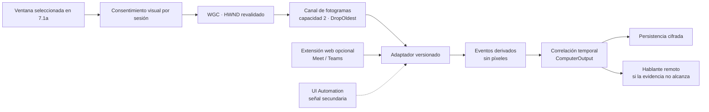

# Etapa 7.2 — Plan de análisis visual y evidencia de hablante activo

> **Decisión:** la siguiente rebanada debe analizar temporalmente **solo la ventana que el usuario ya eligió**, a baja frecuencia y con consentimiento por sesión. Trazio no grabará video, no guardará capturas por defecto y no asignará un nombre cuando la evidencia no alcance.
>
> **Puerta de autorización:** este documento es planificación, no una autorización de implementación. Incorporar Windows Graphics Capture (WGC) requiere una aprobación explícita adicional del usuario antes de modificar código o iniciar una captura visual.

## Resultado esperado

La etapa 7.2 producirá evidencia temporal que permita responder, con un nivel de confianza visible: «hay actividad de un hablante remoto» y, solo cuando un adaptador fiable lo respalde, «la interfaz muestra esta etiqueta como hablante activo».

| Tema | Decisión |
|---|---|
| Activación | Separada de **Seleccionar ventana**, por sesión y desactivada por defecto |
| Superficie | Únicamente la ventana superior revalidada que eligió el usuario |
| Frecuencia | 1 fps por defecto; máximo provisional de 2 fps |
| Memoria | Canal acotado a 2 fotogramas con `DropOldest`; descarte inmediato después del análisis |
| Persistencia | Solo eventos derivados cifrados; nunca píxeles, URL, HWND, PID o título de ventana |
| Degradación | `Hablante remoto`; el audio y la transcripción continúan sin depender del análisis visual |
| Estrategia | Híbrida: WGC como cobertura de escritorio/respaldo y extensión de navegador para señales web fiables |

## Objetivo y límites

### Objetivo

- Analizar visualmente solo la ventana seleccionada para detectar evidencia temporal de hablante activo.
- Correlacionar esa evidencia exclusivamente con segmentos de `ComputerOutput`.
- Conservar procedencia, versión del adaptador y confianza para que la interfaz pueda distinguir evidencia de inferencia.
- Fallar de forma segura: ante duda, pérdida de ventana o cambio de interfaz, usar `Hablante remoto`.

### No objetivos

- Grabar video o reconstruir visualmente una reunión.
- Guardar fotogramas o capturas para depuración, auditoría o entrenamiento.
- Analizar el escritorio completo, ventanas no elegidas, cámara, chat o documentos compartidos.
- Aislar el audio por ventana; WASAPI seguirá capturando el dispositivo configurado.
- Prometer identificación perfecta, biometría facial/voz, diarización con nombres reales o asistencia automática a reuniones.
- Sustituir una corrección humana con una decisión automática irreversible.

## Flujo de consentimiento por sesión

Seleccionar una ventana y autorizar análisis visual son **dos acciones distintas**. Una selección previa nunca activa captura visual de manera implícita.

1. El usuario selecciona la ventana mediante el flujo 7.1a.
2. Trazio muestra **Activar análisis visual** sin marcarlo ni activarlo por defecto.
3. Al pulsarlo, Trazio explica superficie, frecuencia, datos derivados, descarte de imágenes y degradación segura.
4. El usuario acepta o cancela. La elección se consume al terminar la sesión y no se hereda a otra reunión.
5. Mientras esté activo, Trazio mantiene un indicador persistente y no intenta ocultar el borde que Windows presente alrededor de la superficie capturada.
6. **Pausar análisis visual** y **Detener análisis visual** permanecen disponibles durante toda la sesión.
7. Al pausar, detener o fallar el análisis, el audio y la transcripción continúan sin interrupción.

El permiso de una automatización futura de calendario no puede reemplazar este consentimiento sin una regla visual específica, explícita y revocable diseñada en la etapa 11.

## Arquitectura por rebanadas

| Rebanada | Entrega | Criterio para avanzar |
|---|---|---|
| 7.2a | Sustrato WGC seguro y acotado | Captura elegida, estados de fallo y descarte de fotogramas demostrados sin tocar audio/transcripción |
| 7.2b | Actividad visual anónima y correlación temporal | Solo eventos derivados cifrados; abstención fiable cuando no hay evidencia |
| 7.2c | Adaptador Google Meet web | Contrato versionado probado en layouts soportados; extensión con permiso mínimo |
| 7.2d | Adaptador Microsoft Teams web/escritorio | Web cubierto por extensión; escritorio cubierto por WGC y señal secundaria acotada |
| 7.2e | Evaluación, rendimiento y duración | Matriz física aprobada y prueba de 2 horas antes de intentar la de 5 horas |

### 7.2a — Sustrato Windows Graphics Capture

Esta rebanada no identifica personas. Solo demuestra una captura visual efímera, segura y controlable.

- Revalidar HWND y PID inmediatamente antes de crear el `GraphicsCaptureItem`; no reasignar otra ventana si falla.
- Crear el objetivo con `IGraphicsCaptureItemInterop::CreateForWindow` sobre el HWND seleccionado.
- Usar un frame pool de **2 buffers** y un canal administrado acotado a **2** elementos con `DropOldest`.
- Muestrear a 1 fps por defecto y permitir hasta 2 fps durante evaluación. Los fotogramas intermedios se descartan.
- Disponer cada frame y sus superficies tan pronto termine el análisis; ningún consumidor puede retener referencias.
- Procesar fuera del hilo de interfaz y publicar solo cambios de estado o eventos derivados.
- Ante cambio de tamaño, recrear el frame pool y descartar los frames anteriores.
- Ante pérdida de dispositivo, evento `Closed`, ventana minimizada/no disponible o cierre de sesión, detener y liberar la captura visual sin afectar la sesión de audio.
- Ante contenido protegido, negro o inaccesible, informar **Contenido protegido o no disponible**; nunca intentar eludir la protección.
- Mantener una cancelación única por sesión que cierre productores, canal, consumidor y recursos gráficos aun durante una excepción.

| Condición | Respuesta visual | Efecto sobre reunión |
|---|---|---|
| WGC no compatible | Estado **No compatible**; no crear recursos | Audio/transcripción continúan |
| Usuario cancela/deniega | Estado **No activado** | Audio/transcripción continúan |
| Ventana cerrada o reutilizada | Detener análisis; no buscar reemplazo | Audio/transcripción continúan |
| Ventana minimizada | Pausar análisis y permitir reanudar al recuperarla | Audio/transcripción continúan |
| Cambio de tamaño/DPI | Recrear buffers de forma acotada | Puede omitir frames, no audio |
| Dispositivo gráfico perdido | Un intento controlado de recreación; después detener análisis | Audio/transcripción continúan |
| Contenido protegido/inútil | Abstenerse y mostrar estado | `Hablante remoto` |
| Consumidor lento | Descartar el frame más antiguo | Memoria acotada; sin contrapresión hacia audio |

### 7.2b — Actividad visual anónima

La primera inferencia visual debe ser determinista y anónima: detectar cambios coherentes en una región de participante/resaltado, no reconocer rostros ni leer nombres.

- Adaptar por proveedor y layout; no usar un detector universal que confunda presentaciones, chat o animaciones.
- Aplicar umbral, histéresis y duración mínima para evitar alternancia por ruido visual.
- Emitir rangos temporales con confianza y tipo de evidencia; nunca emitir una etiqueta personal desde actividad visual sola.
- Correlacionar con segmentos `ComputerOutput` usando tiempo monotónico de sesión y una tolerancia medida.
- No atribuir eventos visuales a segmentos de micrófono; esos segmentos conservan el perfil local confirmado.
- Si el evento no cubre de forma suficiente el segmento, conservar `Hablante remoto`.
- Persistir únicamente el evento derivado cifrado y sus metadatos no visuales.

### 7.2c — Adaptador Google Meet web

- Crear un adaptador versionado para layouts declarados como soportados.
- Preferir una extensión de Edge/Chrome que lea solo la señal mínima de hablante activo y la etiqueta visible después de un permiso explícito para `meet.google.com`.
- Enviar a la aplicación únicamente eventos derivados mediante IPC local autenticado; no enviar DOM completo, subtítulos, URL, lista de participantes ni contenido de chat.
- Usar WGC como respaldo anónimo cuando la extensión no esté instalada, pierda permiso o no reconozca la versión de la interfaz.
- Desactivar la atribución con nombre si cambia el contrato del proveedor hasta revalidar el adaptador.

### 7.2d — Adaptador Microsoft Teams web y escritorio

- Reutilizar el contrato de extensión para Teams web/PWA en Edge y Chrome, limitado al dominio autorizado.
- Cubrir Teams escritorio con WGC como base; UI Automation puede aportar una señal secundaria, nunca la única prueba para asignar un nombre.
- Versionar por familia de cliente y layout, porque Teams web/PWA y Teams escritorio no comparten necesariamente el mismo árbol visual o de accesibilidad.
- Abstenerse ante ventanas híbridas, controles opacos, contenido protegido o versión desconocida.

### 7.2e — Evaluación, rendimiento y duración

- Ejecutar primero pruebas sintéticas y de integración, luego pruebas físicas cortas.
- Aprobar una prueba física de 2 horas antes de ejecutar la prueba de 5 horas.
- Registrar métricas locales no sensibles: estados, frames recibidos/procesados/descartados, profundidad máxima del canal, latencia, uso de recursos y códigos de fallo.
- No registrar etiquetas de personas, píxeles, títulos, URL, HWND/PID ni texto de reunión en telemetría.

## Alternativas y compromisos

| Alternativa | Ventajas | Riesgos/límites | Uso recomendado |
|---|---|---|---|
| Extensión DOM/accesibilidad del navegador | Señales semánticas y etiquetas más fiables; bajo costo visual | Permisos de sitio, mantenimiento por cambios del proveedor, no cubre Teams escritorio | Fuente principal para Meet/Teams web después de permiso explícito |
| WGC + visión acotada | Cubre aplicaciones de escritorio y web; no necesita leer DOM | Píxeles altamente sensibles, layouts frágiles, costo GPU/CPU, nombres poco fiables | Respaldo y actividad anónima; base para Teams escritorio |
| UI Automation | Puede exponer controles y nombres sin píxeles | Árbol variable/opaco, límites de privilegio, no garantiza semántica de hablante activo | Señal secundaria corroborante; nunca autoridad única |

**Recomendación híbrida:** comenzar con WGC para demostrar captura efímera y actividad anónima. Después, una extensión entrega señales semánticas para Meet/Teams web; WGC cubre Teams escritorio y sirve de degradación. UI Automation solo puede aumentar confianza cuando coincide con otra evidencia.

## Modelo de datos derivado propuesto

El contrato `SpeakerEvidenceEvent` debe representar evidencia, no una afirmación absoluta.

| Campo conceptual | Regla |
|---|---|
| Rango temporal | Inicio y fin relativos a la sesión; reloj monotónico para correlación |
| Etiqueta de hablante | Opcional y cifrada; ausente para actividad visual anónima |
| Proveedor | Enum normalizado existente: Meet, Teams u otro/no seleccionado |
| Confianza | Valor normalizado de 0 a 1 junto con política/umbral versionado |
| Tipo de evidencia | Actividad visual, señal DOM del proveedor, señal de accesibilidad, corrección humana u otra clase explícita |
| Versión del adaptador | Identifica el contrato que produjo el evento |
| Procedencia | Sesión y fuente `ComputerOutput`; creación/revisión cifrada cuando corresponda |

No se persistirán píxeles, superficies Direct3D, URL, HWND, PID, título de ventana, nombre de proceso, DOM, subtítulos, chat ni listas de participantes. Eliminar una sesión debe eliminar también su evidencia derivada.

## Privacidad y seguridad

### Modelo de amenazas

| Riesgo | Control requerido |
|---|---|
| Capturar otra ventana por HWND reutilizado | Revalidar HWND+PID antes de iniciar y detener ante pérdida; nunca reasignar |
| Activación accidental | Estado por defecto OFF, consentimiento por sesión y acción separada |
| Retención de imágenes en RAM/cola | Capacidad 2, `DropOldest`, `Dispose` inmediato y sin caché |
| Escritura accidental de imágenes | No implementar serialización de frames; prohibir screenshots de depuración |
| Fuga por logs o errores | Códigos normalizados y contadores; cero títulos, etiquetas, URL, píxeles o texto |
| Volcado tras un fallo | Trazio no genera dumps de memoria para esta función; cierre `finally` y documentación de la limitación de dumps externos del sistema |
| Adaptador desactualizado o engañado | Versionado, lista de layouts soportados, umbral conservador y abstención |
| Extensión con permisos excesivos | Permiso por dominio, mínimo mensaje derivado, IPC autenticado y revocación visible |
| Crecimiento sin límite o bloqueo | Canales acotados independientes del audio; métricas y kill switch |
| Contenido protegido | Detectar indisponibilidad y detener; nunca intentar evasión |

### Retención y exportación

- Retención de píxeles: **cero**; los frames existen solo durante su procesamiento.
- Los eventos derivados siguen el ciclo de vida cifrado de la sesión y se eliminan con ella.
- Una etiqueta solo sale del almacenamiento local mediante una exportación explícita iniciada por el usuario.
- Las exportaciones deben marcar la procedencia y confianza; no pueden convertir una inferencia en hecho confirmado.
- Las capturas de depuración están prohibidas. Una futura opción para conservar imágenes requeriría diseño, consentimiento, cifrado, retención y eliminación independientes; no se incluye en 7.2.

## Estados y textos de interfaz

El estado no puede depender solo del color. Debe incluir icono, texto accesible y anuncio moderado para lector de pantalla.

| Estado | Texto principal propuesto | Acción disponible |
|---|---|---|
| Desactivado | **Análisis visual desactivado** | Activar análisis visual |
| Consentimiento | **Trazio analizará temporalmente solo la ventana seleccionada. No grabará video ni guardará imágenes.** | Activar / Cancelar |
| No compatible | **Este equipo no admite análisis visual de ventanas. La transcripción continuará sin cambios.** | Cerrar aviso |
| Cancelado/denegado | **No se activó el análisis visual. La transcripción continuará.** | Volver a intentar |
| Activo | **Análisis visual activo · no se guardan imágenes** | Pausar / Detener |
| Pausado por usuario | **Análisis visual pausado** | Reanudar / Detener |
| Ventana perdida | **Se perdió la ventana seleccionada. El análisis visual se detuvo; el audio y la transcripción continúan.** | Seleccionar después de finalizar |
| Ventana minimizada | **La ventana está minimizada. El análisis visual está pausado; el audio y la transcripción continúan.** | Restaurar ventana / Detener |
| Contenido protegido | **El contenido no permite análisis visual. Trazio no intentará omitir esta protección.** | Detener análisis |
| Detenido | **Análisis visual detenido. El audio y la transcripción continúan.** | Sin reactivación silenciosa |

### Accesibilidad

- Todos los controles deben ser alcanzables por teclado, con orden de foco estable y nombres de automatización descriptivos.
- El diálogo devuelve el foco al botón que lo abrió al cancelar y al indicador activo al aceptar.
- Los cambios críticos se anuncian mediante una región accesible; métricas o frames descartados no generan anuncios repetitivos.
- Pausar y detener no dependen de iconos ni color. El borde del sistema no reemplaza el indicador textual de Trazio.

## Contratos técnicos sugeridos

Los nombres siguientes delimitan responsabilidades en C#; no definen todavía una implementación:

| Abstracción | Responsabilidad |
|---|---|
| `IVisualMeetingCapture` | Iniciar/detener WGC sobre un objetivo revalidado y emitir estados de ciclo de vida |
| `IFrameSampler` | Reducir la corriente de WGC a 1–2 fps, conservar capacidad 2 y entregar ownership temporal del frame |
| `IActiveSpeakerAdapter` | Convertir un frame o señal de proveedor en cero o más eventos derivados con evidencia/confianza |
| `ISpeakerEvidenceCorrelator` | Relacionar eventos temporales con segmentos `ComputerOutput` sin tocar segmentos de micrófono |
| `ISpeakerEvidenceStore` | Persistir/leer eventos cifrados y eliminarlos junto con la sesión |
| `IVisualAnalysisTelemetry` | Registrar solo contadores, tiempos, estados y códigos de fallo locales |
| Canal de frames acotado | Capacidad 2, `DropOldest`, productor WGC separado del consumidor visual |
| Canal de eventos acotado | Capacidad provisional 64 con espera en el analizador; una demora descarta frames aguas arriba y nunca bloquea audio |

Los resultados esperados (no soporte, permiso cancelado, objetivo perdido o contenido protegido) deben modelarse como estados explícitos. Las excepciones quedan para fallos inesperados de infraestructura y deben cerrar recursos de manera idempotente.

## Estrategia de pruebas

### Pruebas automatizadas

- **Unitarias con frames sintéticos:** actividad estable, ruido, dos regiones, presentación, cuadro negro, variación de brillo, histéresis y abstención.
- **Canales:** capacidad máxima 2, política `DropOldest`, cancelación, ownership/disposición y consumidor lento.
- **Correlación:** límites temporales, solapamiento, segmentos sin evidencia y prohibición de atribuir a micrófono.
- **Persistencia:** cifrado de etiqueta, eliminación en cascada, versiones desconocidas y prueba negativa que impida almacenar bytes de imagen/campos prohibidos.
- **Adaptadores:** fixtures sintéticos por layout y contrato; una interfaz no reconocida debe abstenerse.
- **UX/presentación:** transición de todos los estados, foco, teclado, nombres accesibles y audio independiente.

### Integración WinRT controlada

- Capturar una ventana de prueba con patrón conocido, luego redimensionar, cambiar DPI, minimizar, restaurar y cerrar.
- Simular pérdida/recreación de dispositivo y verificar liberación del frame pool.
- Confirmar que no quedan archivos de imagen, logs sensibles ni referencias a superficies después de detener.
- Verificar que un fallo visual no cambia el estado ni las colas de captura/transcripción de audio.

### Validación física

| Plataforma | Escenarios mínimos |
|---|---|
| Google Meet web/PWA | Chrome; grilla, orador, presentación, subtítulos on/off, tema claro/oscuro |
| Microsoft Teams web/PWA | Edge y Chrome; grilla, orador, presentación y cambio de layout |
| Microsoft Teams escritorio | Ventana normal, minimizada/restaurada, presentación y controles superpuestos |
| Windows | 100/125/150/200 % DPI, varios monitores, cambio de tamaño, bloqueo de pantalla y reanudación |
| Duración | Sesiones cortas → 30 min → 2 h; solo después, 5 h |

### Métricas provisionales

Son objetivos para validar y ajustar con hardware de referencia; **todavía no están aprobados**.

| Métrica | Umbral provisional |
|---|---|
| Frecuencia | 1 fps normal; nunca más de 2 fps |
| Profundidad de frames | Máximo 2; descartes contabilizados, no tratados como error |
| Latencia de correlación | p95 ≤ 2 s desde evidencia hasta segmento visible |
| Atribución con nombre | ≥ 95 % de precisión en layouts declarados; abstenerse es preferible a una etiqueta falsa |
| Atribución falsa con nombre | ≤ 2 % en el conjunto de evaluación acordado |
| Uso de CPU adicional | Mediana ≤ 10 puntos porcentuales en el equipo de referencia a 1 fps |
| Memoria después de calentamiento | Sin crecimiento monótono; pendiente ≤ 5 MiB/h durante la prueba de 2 h |
| Estabilidad | Cero bloqueos, pérdida de audio o cola visual sin límite durante 2 h |

La cobertura/recall no será criterio inicial: un adaptador puede abstenerse. Primero se protege la precisión y la honestidad de la atribución.

## Criterios de aceptación

- [ ] Existe consentimiento explícito por sesión, separado de seleccionar ventana y desactivado por defecto.
- [ ] El indicador visual permanece visible y Pausar/Detener funciona por teclado y lector de pantalla.
- [ ] Solo la ventana revalidada se captura; no hay reasignación automática.
- [ ] El canal nunca supera dos frames y cada frame se descarta después del análisis.
- [ ] No se crean videos, screenshots, dumps propios, logs sensibles ni registros de píxeles.
- [ ] Minimizar, cerrar, proteger o perder la ventana no detiene audio/transcripción.
- [ ] Solo `ComputerOutput` recibe evidencia remota; el micrófono conserva la identidad local.
- [ ] Las etiquetas con nombre siempre incluyen proveedor, evidencia, confianza y versión de adaptador.
- [ ] La evidencia insuficiente produce `Hablante remoto`, no una conjetura.
- [ ] Cada adaptador declara y prueba sus layouts/versiones compatibles.
- [ ] Las pruebas automatizadas e integración pasan antes de la matriz física.
- [ ] La prueba de 2 horas cumple recursos/estabilidad antes de autorizar la de 5 horas.

## Riesgos, despliegue y reversión

| Riesgo | Mitigación / reversión |
|---|---|
| Regresión en captura de audio | Módulo y canales independientes; kill switch visual no toca `RecordingCoordinator` de audio |
| Cambio de UI de Meet/Teams | Desactivar solo el adaptador afectado y volver a `Hablante remoto` |
| Sobrecarga o fuga gráfica | Límites duros, métricas locales, prueba de 2 h y apagado idempotente |
| Problema de privacidad | OFF por defecto, consentimiento consumible, cero retención de frames y exportación explícita |
| Falso positivo | Umbral conservador, versión de política, abstención y corrección humana |
| Incompatibilidad de Windows/GPU | Detección de soporte previa y fallback sin análisis visual |

El despliegue debe usar un **feature flag local**, inicialmente OFF, más un switch por adaptador. La reversión consiste en deshabilitar el módulo visual y conservar intactos grabación, transcripción, historial y eventos ya cifrados. No se requiere conectividad remota para el kill switch.

## Decisiones pendientes antes de implementar

- [ ] Obtener autorización explícita del usuario para implementar WGC bajo este alcance.
- [ ] Confirmar la versión mínima de Windows/SDK y el comportamiento de equipos actualmente distribuidos.
- [ ] Elegir y revisar la dependencia de interop/Direct3D; usar el ejemplo WPF de Microsoft como referencia, no como copia ciega.
- [ ] Definir el conjunto inicial de layouts soportados y el corpus sintético/físico de evaluación.
- [ ] Definir la tolerancia temporal exacta y calibrar umbrales en español/uso real.
- [ ] Diseñar autenticación y permisos mínimos del futuro canal extensión ↔ aplicación.
- [ ] Revisar legalmente el texto de consentimiento y la política de retención de eventos derivados.
- [ ] Decidir si una retención de eventos más corta que la sesión aporta valor sin romper auditoría.

## Fuentes oficiales

- Microsoft Learn: [Captura de pantalla con Windows Graphics Capture](https://learn.microsoft.com/en-us/windows/apps/develop/media-authoring-processing/screen-capture).
- Microsoft Learn: [`IGraphicsCaptureItemInterop::CreateForWindow`](https://learn.microsoft.com/en-us/windows/win32/api/windows.graphics.capture.interop/nf-windows-graphics-capture-interop-igraphicscaptureiteminterop-createforwindow).
- Microsoft: [ejemplo WPF Screen Capture](https://github.com/microsoft/Windows.UI.Composition-Win32-Samples/tree/master/dotnet/WPF/ScreenCapture) y [licencia MIT del repositorio](https://github.com/microsoft/Windows.UI.Composition-Win32-Samples/blob/master/LICENSE).
- Microsoft Learn: [Llamar API de Windows Runtime desde aplicaciones de escritorio](https://learn.microsoft.com/en-us/windows/apps/desktop/modernize/desktop-to-uwp-enhance).
- Microsoft Learn: [Fundamentos de UI Automation](https://learn.microsoft.com/en-us/windows/win32/winauto/entry-uiautocore-overview) y [consideraciones de seguridad](https://learn.microsoft.com/en-us/dotnet/framework/ui-automation/ui-automation-security-overview).
- Microsoft Learn: [Microsoft Teams web como PWA](https://learn.microsoft.com/en-us/microsoftteams/teams-progressive-web-apps).
- Ayuda de Google Meet: [aplicación web progresiva de Google Meet](https://support.google.com/meet/answer/10708569?hl=es).

## Siguiente paso

No iniciar 7.2a hasta recibir autorización explícita para implementar Windows Graphics Capture. Con esa aprobación, la primera entrega se limita al sustrato WGC, estados UX, descarte de frames y pruebas; todavía no intentará identificar ni nombrar hablantes.
