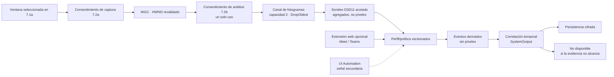

# Etapa 7.2 — Plan de análisis visual y evidencia de hablante activo

> **Decisión:** 7.2b analiza temporalmente **solo la ventana que el usuario ya eligió**, a baja frecuencia y con un consentimiento adicional de un solo uso. Trazio no graba video, no conserva píxeles/imágenes y no asigna un nombre a partir de esta evidencia.
>
> **Puerta de autorización:** seleccionar la ventana, autorizar la captura WGC 7.2a y autorizar el análisis anónimo 7.2b son acciones distintas. La autorización 7.2b se consume una sola vez y queda ligada a la ventana, proveedor, sesión y alcance exactos. No autoriza identificación de hablantes ni adaptadores 7.2c/7.2d.

> **Estado:** la versión pública actual [`v0.2.0-beta.8`](https://github.com/Andres-MMG/Trazio-Asistente-Reunion/releases/tag/v0.2.0-beta.8) incluye 7.2a, la infraestructura de 7.2b y el ensamblado compartido `VisualAnalysis`. La verificación aprobó Release serial/paralelo **543/543**, el filtro enfocado actual de cinco clases **48/48**, los contratos finales **22/22** y el harness desechable **14/14**. El layout final **495/495**, con `ProductVersion` `0.2.0-beta.8+20c94272261f5697a548c56754039029b23f1548`, excluye `VisualEvaluation`, el [corpus sintético agregado y su golden](../evaluation/stage-7b/README.md), `tools` y `evaluation`; mantiene exactamente cinco capacidades. El tag resuelve a `20c94272261f5697a548c56754039029b23f1548`. La evaluación sintética no es calibración física: Meet/Teams permanecen `Unvalidated`, se abstienen y muestran **No disponible**; no existe identificación de hablantes. Siguen pendientes WGC/GPU/interfaz/accesibilidad/Meet/Teams físicos, 2/5 horas y firma.

## Resultado esperado

La infraestructura 7.2b puede representar evidencia temporal anónima de cobertura/actividad. Solo un perfil previamente calibrado y marcado `Validated` podría producir una coincidencia; en producción, Meet/Teams siguen `Unvalidated` y la respuesta es **No disponible**. La futura atribución con nombre requiere adaptadores y autorización independientes.

| Tema | Decisión |
|---|---|
| Activación | Separada de **Seleccionar ventana**, por sesión y desactivada por defecto |
| Superficie | Únicamente la ventana superior revalidada que eligió el usuario |
| Frecuencia | 1 fps por defecto; máximo provisional de 2 fps |
| Memoria | Canal acotado a 2 fotogramas con `DropOldest`; descarte inmediato después del análisis |
| Persistencia | Solo intervalos derivados cifrados de cobertura/actividad; nunca píxeles, URL, HWND, PID o título de ventana |
| Degradación | **No disponible**; el audio y la transcripción continúan sin depender del análisis visual |
| Estrategia | Híbrida: WGC como cobertura de escritorio/respaldo y extensión de navegador para señales web fiables |

## Objetivo y límites

### Objetivo

- Analizar visualmente solo la ventana seleccionada para detectar evidencia temporal de hablante activo.
- Correlacionar esa evidencia exclusivamente con segmentos de `SystemOutput`.
- Conservar procedencia, versión del adaptador y confianza para que la interfaz pueda distinguir evidencia de inferencia.
- Fallar de forma segura: ante duda, perfil no validado, pérdida de ventana o cambio de interfaz, mostrar **No disponible** y abstenerse.

### No objetivos

- Grabar video o reconstruir visualmente una reunión.
- Guardar píxeles, fotogramas, imágenes o capturas para depuración, auditoría o entrenamiento.
- Analizar el escritorio completo, ventanas no elegidas, cámara, OCR, rostros, nombres, chat, subtítulos o documentos compartidos.
- Aislar el audio por ventana; WASAPI seguirá capturando el dispositivo configurado.
- Prometer identificación perfecta, biometría facial/voz, diarización con nombres reales o asistencia automática a reuniones.
- Sustituir una corrección humana con una decisión automática irreversible.

## Flujo de consentimiento por sesión

Seleccionar una ventana, autorizar captura WGC y autorizar análisis anónimo son **tres acciones distintas**. Una selección previa nunca activa captura ni análisis de manera implícita.

1. El usuario selecciona la ventana mediante el flujo 7.1a.
2. Trazio ofrece **Autorizar captura visual** para 7.2a; cancelar sigue siendo la opción predeterminada.
3. El usuario inicia una sesión que captura `SystemOutput`. Sin esa fuente, 7.2b no se puede activar.
4. Trazio ofrece **Autorizar análisis anónimo** en un diálogo separado. Explica que no identifica personas, no lee OCR/rostros/nombres/chat/subtítulos/documentos, no guarda imágenes/video y solo conserva intervalos derivados cifrados.
5. Al aceptar, se crea una autorización versión 1 de un solo uso, ligada a la selección, sesión y alcance `ActivityAndAvailabilityIntervals`. Se consume al activar; no se hereda, persiste ni reutiliza.
6. Mientras WGC esté activo, Trazio mantiene un indicador persistente y no intenta ocultar el borde que Windows presente alrededor de la superficie capturada.
7. **Pausar visual**, **Reanudar visual** y **Detener visual** controlan WGC. Al pausar, detener o fallar el análisis, el audio y la transcripción continúan sin interrupción.

El permiso de una automatización futura de calendario no puede reemplazar este consentimiento sin una regla visual específica, explícita y revocable diseñada en la etapa 11.

## Arquitectura por rebanadas

| Rebanada | Entrega | Criterio para avanzar |
|---|---|---|
| 7.2a | Sustrato WGC seguro y acotado | Captura elegida, estados de fallo y descarte de fotogramas demostrados sin tocar audio/transcripción |
| 7.2b | Actividad visual anónima y correlación temporal | Infraestructura fuente implementada; perfiles de producción aún `Unvalidated`, con abstención y **No disponible** |
| 7.2c | Adaptador Google Meet web | Contrato versionado probado en layouts soportados; extensión con permiso mínimo |
| 7.2d | Adaptador Microsoft Teams web/escritorio | Web cubierto por extensión; escritorio cubierto por WGC y señal secundaria acotada |
| 7.2e | Evaluación, rendimiento y duración | Matriz física aprobada y prueba de 2 horas antes de intentar la de 5 horas |

### 7.2a — Sustrato Windows Graphics Capture

Esta rebanada no identifica personas. Solo demuestra una captura visual efímera, segura y controlable.

**Estado:** implementada en código e incluida desde beta 3. La aceptación continúa abierta hasta completar WGC/GPU físico, teclado/lector de pantalla y duración. La recuperación ante pérdida del dispositivo se normaliza como fallo visual seguro; una recreación controlada del dispositivo queda pendiente.

- Revalidar HWND y PID inmediatamente antes de crear el `GraphicsCaptureItem`; no reasignar otra ventana si falla.
- Crear el objetivo con `IGraphicsCaptureItemInterop::CreateForWindow` sobre el HWND seleccionado.
- Usar un frame pool de **2 buffers** y un canal administrado acotado a **2** elementos con `DropOldest`.
- Muestrear a 1 fps por defecto y permitir hasta 2 fps durante evaluación. Los fotogramas intermedios se descartan.
- Disponer cada frame y sus superficies tan pronto termine el análisis; ningún consumidor puede retener referencias.
- Procesar fuera del hilo de interfaz y publicar solo cambios de estado o eventos derivados.
- Ante cambio de tamaño, recrear el frame pool y descartar los frames anteriores.
- Ante pérdida de dispositivo, evento `Closed`, ventana minimizada/no disponible o cierre de sesión, detener y liberar la captura visual sin afectar la sesión de audio.
- Ante contenido protegido, negro o inaccesible, informar **Contenido protegido o no disponible**; nunca intentar eludir la protección.
- Mantener una cancelación única por sesión que cierre productores, canal, consumidor y recursos gráficos aun durante una excepción.

| Condición | Respuesta visual | Efecto sobre reunión |
|---|---|---|
| WGC no compatible | Estado **No compatible**; no crear recursos | Audio/transcripción continúan |
| Usuario cancela/deniega | Estado **No activado** | Audio/transcripción continúan |
| Ventana cerrada o reutilizada | Detener análisis; no buscar reemplazo | Audio/transcripción continúan |
| Ventana minimizada | Pausar análisis y permitir reanudar al recuperarla | Audio/transcripción continúan |
| Cambio de tamaño/DPI | Recrear buffers de forma acotada | Puede omitir frames, no audio |
| Dispositivo gráfico perdido | Un intento controlado de recreación; después detener análisis | Audio/transcripción continúan |
| Contenido protegido/inútil | Abstenerse y mostrar estado | **No disponible** |
| Consumidor lento | Descartar el frame más antiguo | Memoria acotada; sin contrapresión hacia audio |

### 7.2b — Actividad visual anónima

**Estado:** infraestructura publicada desde beta 5 y vigente en beta 8. La lógica compartida vive en `VisualAnalysis`; el evaluador/corpus continúan como herramientas offline del código fuente y no se empaquetan. El comportamiento de producción continúa deliberadamente abstencionista. La inferencia visual es determinista y anónima: evalúa cambios coherentes en parches declarados por un perfil validado, sin reconocer rostros ni leer nombres. Los perfiles de Meet/Teams incluidos están `Unvalidated`, con cero parches y sin política; por tanto, no leen superficies para inferencia, producen cobertura no disponible y no generan actividad positiva. El corpus usa únicamente agregados sintéticos y políticas ya empleadas por pruebas; no recomienda ni habilita umbrales.

- [D3D11VisualProbeExtractor](../src/Trazio.AsistenteReunion.App/D3D11VisualProbeExtractor.cs) acepta como máximo parches acotados de 16 × 16, los copia a un atlas de staging limitado y devuelve únicamente agregados numéricos de coincidencia, contenido no negro y luminancia media. Los bytes mapeados se limpian y no se serializan.
- [VisualProbeSession](../src/Trazio.AsistenteReunion.App/VisualProbeSession.cs) limita la frecuencia, conserva como máximo una observación pendiente y descarta o combina trabajo obsoleto sin bloquear audio. La canalización de evidencia también es acotada.
- [DeterministicVisualActivityDetector](../src/Trazio.AsistenteReunion.VisualAnalysis/DeterministicVisualActivityDetector.cs) exige un perfil `Validated`, política versionada, coherencia mínima, histéresis y duraciones de activación/liberación. Un perfil no validado produce abstención.
- Emitir rangos temporales de cobertura/actividad con confianza y procedencia versionada; nunca una etiqueta personal.
- Correlacionar solo con segmentos `SystemOutput` usando el reloj monotónico de sesión. Los segmentos de micrófono permanecen ocultos para esta evidencia y conservan el perfil local confirmado.
- Si falta cobertura, la evidencia está corrupta/no compatible o no existe una política validada, mostrar **No disponible**. Una cobertura suficiente sin actividad puede mostrar **Insuficiente**; solo evidencia validada podría mostrar **Coincidente**.
- Persistir únicamente el intervalo derivado cifrado y sus metadatos no visuales. La presentación en vivo y en Historial usa instantáneas separadas y descarta resultados obsoletos.
- La transcripción, `SpeakerName` y las exportaciones TXT, Markdown y Obsidian permanecen sin cambios.

### 7.2c — Adaptador Google Meet web

- Crear un adaptador versionado para layouts declarados como soportados.
- Preferir una extensión de Edge/Chrome que lea solo la señal mínima de hablante activo y la etiqueta visible después de un permiso explícito para `meet.google.com`.
- Enviar a la aplicación únicamente eventos derivados mediante IPC local autenticado; no enviar DOM completo, subtítulos, URL, lista de participantes ni contenido de chat.
- Usar WGC como respaldo anónimo cuando la extensión no esté instalada, pierda permiso o no reconozca la versión de la interfaz.
- Desactivar la atribución con nombre si cambia el contrato del proveedor hasta revalidar el adaptador.

### 7.2d — Adaptador Microsoft Teams web y escritorio

- Reutilizar el contrato de extensión para Teams web/PWA en Edge y Chrome, limitado al dominio autorizado.
- Cubrir Teams escritorio con WGC como base; UI Automation puede aportar una señal secundaria, nunca la única prueba para asignar un nombre.
- Versionar por familia de cliente y layout, porque Teams web/PWA y Teams escritorio no comparten necesariamente el mismo árbol visual o de accesibilidad.
- Abstenerse ante ventanas híbridas, controles opacos, contenido protegido o versión desconocida.

### 7.2e — Evaluación, rendimiento y duración

- Ejecutar primero pruebas sintéticas y de integración, luego pruebas físicas cortas.
- Aprobar una prueba física de 2 horas antes de ejecutar la prueba de 5 horas.
- Registrar métricas locales no sensibles: estados, frames recibidos/procesados/descartados, profundidad máxima del canal, latencia, uso de recursos y códigos de fallo.
- No registrar etiquetas de personas, píxeles, títulos, URL, HWND/PID ni texto de reunión en telemetría.

## Alternativas y compromisos

| Alternativa | Ventajas | Riesgos/límites | Uso recomendado |
|---|---|---|---|
| Extensión DOM/accesibilidad del navegador | Señales semánticas y etiquetas más fiables; bajo costo visual | Permisos de sitio, mantenimiento por cambios del proveedor, no cubre Teams escritorio | Fuente principal para Meet/Teams web después de permiso explícito |
| WGC + visión acotada | Cubre aplicaciones de escritorio y web; no necesita leer DOM | Píxeles altamente sensibles, layouts frágiles, costo GPU/CPU, nombres poco fiables | Respaldo y actividad anónima; base para Teams escritorio |
| UI Automation | Puede exponer controles y nombres sin píxeles | Árbol variable/opaco, límites de privilegio, no garantiza semántica de hablante activo | Señal secundaria corroborante; nunca autoridad única |

**Recomendación híbrida:** comenzar con WGC para demostrar captura efímera y actividad anónima. Después, una extensión entrega señales semánticas para Meet/Teams web; WGC cubre Teams escritorio y sirve de degradación. UI Automation solo puede aumentar confianza cuando coincide con otra evidencia.

## Modelo de datos derivado

El contrato implementado `AnonymousVisualEvidenceInterval` representa evidencia anónima, no una afirmación de identidad. Una futura etiqueta personal requeriría otro contrato y otra autorización.

| Campo conceptual | Regla |
|---|---|
| Rango temporal | Inicio y fin relativos a la sesión; reloj monotónico para correlación |
| Etiqueta de hablante | No existe en 7.2b; la actividad visual anónima nunca escribe `SpeakerName` |
| Proveedor | Enum normalizado existente: Meet, Teams u otro/no seleccionado |
| Confianza | Valor normalizado de 0 a 1 junto con política/umbral versionado |
| Tipo de evidencia | `Activity` o `Coverage`; la cobertura declara disponibilidad o indisponibilidad |
| Versiones de procedencia | Perfil, evidencia, detector y política que produjeron el intervalo |
| Procedencia | Sesión y fuente `SystemOutput`; creación/revisión cifrada cuando corresponda |

No se persisten píxeles, superficies Direct3D, imágenes, video, URL, HWND, PID, título de ventana, nombre de proceso, DOM, OCR, rostros, nombres, subtítulos, chat, documentos ni listas de participantes. La tabla de evidencia usa FK `ON DELETE CASCADE`, por lo que eliminar una sesión elimina también sus intervalos derivados cifrados.

## Privacidad y seguridad

### Modelo de amenazas

| Riesgo | Control requerido |
|---|---|
| Capturar otra ventana por HWND reutilizado | Revalidar HWND+PID antes de iniciar y detener ante pérdida; nunca reasignar |
| Activación accidental | Estado por defecto OFF, consentimiento por sesión y acción separada |
| Retención de imágenes en RAM/cola | Capacidad 2, `DropOldest`, `Dispose` inmediato y sin caché |
| Escritura accidental de imágenes | No implementar serialización de frames; prohibir screenshots de depuración |
| Fuga por logs o errores | Códigos normalizados y contadores; cero títulos, etiquetas, URL, píxeles o texto |
| Volcado tras un fallo | Trazio no genera dumps de memoria para esta función; cierre `finally` y documentación de la limitación de dumps externos del sistema |
| Adaptador desactualizado o engañado | Versionado, lista de layouts soportados, umbral conservador y abstención |
| Extensión con permisos excesivos | Permiso por dominio, mínimo mensaje derivado, IPC autenticado y revocación visible |
| Crecimiento sin límite o bloqueo | Canales acotados independientes del audio; métricas y kill switch |
| Contenido protegido | Detectar indisponibilidad y detener; nunca intentar evasión |

### Retención y exportación

- Retención de píxeles: **cero**; los frames existen solo durante su procesamiento.
- Los eventos derivados siguen el ciclo de vida cifrado de la sesión y se eliminan con ella.
- La evidencia visual anónima no se exporta en beta 8. TXT, Markdown y Obsidian mantienen la transcripción y `SpeakerName` existentes sin agregar actividad visual.
- Una exportación futura de evidencia requeriría diseño y consentimiento explícitos, procedencia/confianza visibles y nunca podría convertir una inferencia en hecho confirmado.
- Las capturas de depuración están prohibidas. Una futura opción para conservar imágenes requeriría diseño, consentimiento, cifrado, retención y eliminación independientes; no se incluye en 7.2.

## Estados y textos de interfaz

El estado no puede depender solo del color. Debe incluir icono, texto accesible y anuncio moderado para lector de pantalla.

| Estado | Texto principal propuesto | Acción disponible |
|---|---|---|
| Desactivado | **Análisis visual desactivado** | Autorizar… |
| Consentimiento | **Trazio analizará temporalmente solo la ventana seleccionada. No grabará video ni guardará imágenes.** | Autorizar análisis visual / Cancelar |
| No compatible | **Este equipo no admite análisis visual de ventanas. La transcripción continuará sin cambios.** | Cerrar aviso |
| Cancelado/denegado | **No se activó el análisis visual. La transcripción continuará.** | Volver a intentar |
| Activo | **Análisis visual activo · no se guardan imágenes** | Pausar / Detener |
| Pausado por usuario | **Análisis visual pausado** | Reanudar / Detener |
| Ventana perdida | **Se perdió la ventana seleccionada. El análisis visual se detuvo; el audio y la transcripción continúan.** | Seleccionar después de finalizar |
| Ventana minimizada | **La ventana está minimizada. El análisis visual está pausado; el audio y la transcripción continúan.** | Restaurar ventana / Detener |
| Contenido protegido | **El contenido no permite análisis visual. Trazio no intentará omitir esta protección.** | Detener análisis |
| Detenido | **Análisis visual detenido. El audio y la transcripción continúan.** | Sin reactivación silenciosa |

La evidencia por segmento tiene estados separados: **Analizando**, **Coincidente**, **Insuficiente** y **No disponible**. Solo se muestra en filas `SystemOutput`; para micrófono permanece oculta. **Analizando/Coincidente/Insuficiente** requieren una política validada. Con los perfiles de producción actuales, o ante errores/formatos desconocidos, la salida fail-closed es **No disponible** en vivo y en Historial.

### Accesibilidad

- Todos los controles deben ser alcanzables por teclado, con orden de foco estable y nombres de automatización descriptivos.
- El diálogo devuelve el foco al botón que lo abrió al cancelar y al estado visual autorizado/activo al aceptar.
- Los cambios críticos se anuncian mediante una región accesible; métricas o frames descartados no generan anuncios repetitivos.
- Pausar y detener no dependen de iconos ni color. El borde del sistema no reemplaza el indicador textual de Trazio.

## Contratos técnicos de 7.2a/7.2b y propuestas posteriores

`IVisualMeetingCapture`, `IFrameSampler` y el controlador de sesión delimitan 7.2a. 7.2b añade contratos de perfil, extractor, detector, canalización, persistencia y proyección. Los adaptadores con nombres continúan como propuesta:

| Abstracción | Responsabilidad |
|---|---|
| `IVisualMeetingCapture` | Iniciar/detener WGC sobre un objetivo revalidado y emitir estados de ciclo de vida |
| `IFrameSampler` | Reducir la corriente de WGC a 1–2 fps, conservar capacidad 2 y entregar ownership temporal del frame |
| `IVisualProbeProfile` / `VisualProbeDetectionPolicy` | Declarar proveedor/layout/versiones/parches/umbrales; solo `Validated` habilita extracción positiva |
| `IVisualProbeExtractor` | Convertir parches D3D11 acotados en agregados; no entregar píxeles fuera del frame |
| `IVisualProbeDetector` | Convertir observaciones en intervalos anónimos de cobertura/actividad o abstención explícita |
| `AnonymousVisualActivityCorrelator` | Relacionar intervalos temporales con segmentos `SystemOutput` sin tocar micrófono ni `SpeakerName` |
| `SqliteVisualProbeEvidenceSink` / `SqliteSessionStore` | Persistir/leer intervalos cifrados y eliminarlos junto con la sesión |
| `AnonymousVisualEvidenceProjector` | Presentar estados fail-closed con instantáneas independientes para sesión activa e Historial |
| Futuro adaptador de hablante | Requerirá contrato/consentimiento propios; no forma parte de 7.2b |
| Futuro `IVisualAnalysisTelemetry` | Podría registrar solo contadores, tiempos, estados y códigos de fallo locales; no está implementado en 7.2b |
| Canal de frames acotado | Capacidad 2, `DropOldest`, productor WGC separado del consumidor visual |
| Canal de observaciones acotado | Capacidad 2 con `DropOldest`; el productor mantiene además una sola observación pendiente y nunca bloquea audio |

Los resultados esperados (no soporte, permiso cancelado, objetivo perdido o contenido protegido) deben modelarse como estados explícitos. Las excepciones quedan para fallos inesperados de infraestructura y deben cerrar recursos de manera idempotente.

## Estrategia de pruebas

### Pruebas automatizadas

La evidencia histórica de 7.2a registra **54/54 pruebas enfocadas** (`Area=VisualCapture`) y la base funcional beta 3 `b075958` registra **250/250 pruebas seriales** con compilación Release sin errores ni advertencias. La beta 4 publicada completó **4/4 `VersionMetadataTests`**, **132/132 pruebas `Area=VisualCapture`**, **371/371 pruebas Release seriales**, **371/371 pruebas Release en paralelo predeterminado** y una compilación con **0 advertencias y 0 errores**. El contrato de publicación y la prueba básica por canal con nombre aprobaron; el layout coincidió en **494/494 archivos byte a byte**, con **0** hallazgos prohibidos, **0** rutas fuente locales y **0** referencias CodeView. El tag corresponde a `f871f20c3bf9e77b0cf9ad51134febb83c673de7`, y el tamaño/digest del ZIP remoto coinciden con el paquete local y el archivo lateral publicado. El código fuente posterior incorporó una regresión sintética versionada que cubre histéresis, límites temporales, discontinuidades, disponibilidad, exclusión de micrófono, falso positivo deliberado, latencia y presupuestos; `verify` compara el informe canónico byte a byte. La verificación independiente aprobó **74/74 pruebas `VisualEvaluation`**, **206/206 pruebas `Area=VisualCapture`**, **446/446 pruebas Release seriales**, **446/446 pruebas Release en paralelo predeterminado**, el comando CLI `verify` y una compilación con **0 advertencias y 0 errores**. El golden canónico mide **23.193 bytes** y su SHA-256 es `6BBA6F4BA88482FE6616E4145C0840EBAD2BE0A34C9F20832B44500C13BE1738`. Esta evidencia forma parte de la verificación fuente de beta 5, pero sigue basada en datos sintéticos: no ejecuta una captura WGC/GPU real ni valida el escritorio renderizado, accesibilidad, Meet/Teams o duración. El evaluador, corpus y golden permanecen fuera del paquete.

La verificación final de beta 5 agregó `VersionMetadataTests` **4/4**, `publish` y smoke IPC integrado/explícito aprobados, además de un layout **495/495** archivos byte a byte. `VisualAnalysis.dll` estuvo presente y versionada; evaluador, corpus/golden, `tools` y `evaluation` estuvieron ausentes; se conservaron cinco capacidades y hubo **0** hallazgos prohibidos, rutas fuente locales o referencias CodeView. El ZIP publicado mide **86,829,207 bytes** y su SHA-256 es `0031cab096013b7bb436221a75d874719cc1d47ed03ac4047000b4e3094ddbdf`; tamaño y digest remotos coinciden y el archivo lateral está publicado.

Como antecedentes históricos, beta 6 aprobó Release serial/paralelo **451/451** y beta 7 aprobó **520/520**, ambas con layout final **495/495**. La beta 8 pública aprobó **543/543** en serie y paralelo y conserva `VisualAnalysis.dll`, exactamente cinco capacidades y cero hallazgos prohibidos, rutas locales o CodeView; evaluador, corpus/golden, `tools` y `evaluation` permanecen ausentes. Esta evidencia no sustituye WGC/GPU, interfaz/accesibilidad, Meet/Teams o duración reales.

- [VisualCaptureSessionControllerTests](../tests/Trazio.AsistenteReunion.Tests/VisualCaptureSessionControllerTests.cs)
- [BoundedDropOldestProcessorTests](../tests/Trazio.AsistenteReunion.Tests/BoundedDropOldestProcessorTests.cs)
- [WindowsGraphicsCaptureServiceTests](../tests/Trazio.AsistenteReunion.Tests/WindowsGraphicsCaptureServiceTests.cs)
- [VisualCapturePresentationTests](../tests/Trazio.AsistenteReunion.Tests/VisualCapturePresentationTests.cs)
- [AnonymousVisualAnalysisActivationTests](../tests/Trazio.AsistenteReunion.Tests/AnonymousVisualAnalysisActivationTests.cs)
- [D3D11VisualProbeExtractorTests](../tests/Trazio.AsistenteReunion.Tests/D3D11VisualProbeExtractorTests.cs)
- [VisualProbeProfileTests](../tests/Trazio.AsistenteReunion.Tests/VisualProbeProfileTests.cs)
- [VisualProbePipelineTests](../tests/Trazio.AsistenteReunion.Tests/VisualProbePipelineTests.cs)
- [DeterministicVisualActivityDetectorTests](../tests/Trazio.AsistenteReunion.Tests/DeterministicVisualActivityDetectorTests.cs)
- [SqliteVisualProbeEvidenceSinkTests](../tests/Trazio.AsistenteReunion.Tests/SqliteVisualProbeEvidenceSinkTests.cs)
- [AnonymousVisualActivityCorrelatorTests](../tests/Trazio.AsistenteReunion.Tests/AnonymousVisualActivityCorrelatorTests.cs)
- [AnonymousVisualEvidencePresentationTests](../tests/Trazio.AsistenteReunion.Tests/AnonymousVisualEvidencePresentationTests.cs)

- **Unitarias con frames sintéticos:** actividad estable, ruido, dos regiones, presentación, cuadro negro, variación de brillo, histéresis y abstención.
- **Canales:** capacidad máxima 2, política `DropOldest`, una sola observación pendiente, cancelación, ownership/disposición y consumidor lento.
- **Correlación:** límites temporales, solapamiento, segmentos sin evidencia y prohibición de atribuir a cualquier fuente distinta de `SystemOutput`.
- **Persistencia:** cifrado de etiqueta, eliminación en cascada, versiones desconocidas y prueba negativa que impida almacenar bytes de imagen/campos prohibidos.
- **Adaptadores:** fixtures sintéticos por layout y contrato; una interfaz no reconocida debe abstenerse.
- **UX/presentación:** transición de todos los estados, foco, teclado, nombres accesibles y audio independiente.

### Integración WinRT controlada

- Capturar una ventana de prueba con patrón conocido, luego redimensionar, cambiar DPI, minimizar, restaurar y cerrar.
- Simular pérdida/recreación de dispositivo y verificar liberación del frame pool.
- Confirmar que no quedan archivos de imagen, logs sensibles ni referencias a superficies después de detener.
- Verificar que un fallo visual no cambia el estado ni las colas de captura/transcripción de audio.

### Validación física

| Plataforma | Escenarios mínimos |
|---|---|
| Google Meet web/PWA | Chrome; grilla, orador, presentación, subtítulos on/off, tema claro/oscuro |
| Microsoft Teams web/PWA | Edge y Chrome; grilla, orador, presentación y cambio de layout |
| Microsoft Teams escritorio | Ventana normal, minimizada/restaurada, presentación y controles superpuestos |
| Windows | 100/125/150/200 % DPI, varios monitores, cambio de tamaño, bloqueo de pantalla y reanudación |
| Duración | Sesiones cortas → 30 min → 2 h; solo después, 5 h |

### Métricas provisionales

Son objetivos para validar y ajustar con hardware de referencia; **todavía no están aprobados**.

| Métrica | Umbral provisional |
|---|---|
| Frecuencia | 1 fps normal; nunca más de 2 fps |
| Profundidad de frames | Máximo 2; descartes contabilizados, no tratados como error |
| Latencia de correlación | p95 ≤ 2 s desde evidencia hasta segmento visible |
| Atribución con nombre | ≥ 95 % de precisión en layouts declarados; abstenerse es preferible a una etiqueta falsa |
| Atribución falsa con nombre | ≤ 2 % en el conjunto de evaluación acordado |
| Uso de CPU adicional | Mediana ≤ 10 puntos porcentuales en el equipo de referencia a 1 fps |
| Memoria después de calentamiento | Sin crecimiento monótono; pendiente ≤ 5 MiB/h durante la prueba de 2 h |
| Estabilidad | Cero bloqueos, pérdida de audio o cola visual sin límite durante 2 h |

La cobertura/recall no será criterio inicial: un adaptador puede abstenerse. Primero se protege la precisión y la honestidad de la atribución.

## Criterios de aceptación

- [x] Existen en código consentimientos separados para captura 7.2a y análisis anónimo 7.2b; el segundo es de un solo uso, por sesión/ventana/alcance y está desactivado por defecto. Falta validación física de la interfaz.
- [ ] El indicador visual permanece visible y Pausar/Detener funciona por teclado y lector de pantalla.
- [x] El backend solo crea captura para la ventana HWND/PID revalidada y no reasigna; falta demostrarlo físicamente.
- [x] La infraestructura 7.2b mantiene canales/observaciones acotados y disposición determinista; el extractor entrega agregados numéricos, no buffers de píxeles persistibles.
- [x] El código 7.2a/7.2b no crea videos, screenshots, dumps propios, logs sensibles ni registros de píxeles; el script y la inspección del ZIP beta 8 publicado rechazaron esas clases. Falta inspeccionar la ejecución física.
- [ ] Minimizar, cerrar, proteger o perder la ventana no detiene audio/transcripción.
- [x] La correlación en código solo admite `SystemOutput`; el micrófono queda oculto y conserva la identidad local. Falta aceptación en la interfaz física.
- [x] Los perfiles de producción Meet/Teams permanecen `Unvalidated`, se abstienen y proyectan **No disponible**; falta validarlo con aplicaciones reales.
- [x] La presentación de evidencia no modifica transcripción, `SpeakerName`, TXT, Markdown ni Obsidian.
- [ ] Las etiquetas con nombre siempre incluyen proveedor, evidencia, confianza y versión de adaptador.
- [ ] Una futura atribución con nombre usa un fallback anónimo, no una conjetura; 7.2b actual muestra **Insuficiente** o **No disponible**.
- [ ] Cada adaptador declara y prueba sus layouts/versiones compatibles.
- [ ] Las pruebas automatizadas e integración pasan antes de la matriz física.
- [ ] La prueba de 2 horas cumple recursos/estabilidad antes de autorizar la de 5 horas.

## Riesgos, despliegue y reversión

| Riesgo | Mitigación / reversión |
|---|---|
| Regresión en captura de audio | Módulo y canales independientes; kill switch visual no toca `RecordingCoordinator` de audio |
| Cambio de UI de Meet/Teams | Mantener/desactivar el perfil afectado como `Unvalidated` y volver a **No disponible** |
| Sobrecarga o fuga gráfica | Límites duros, métricas locales, prueba de 2 h y apagado idempotente |
| Problema de privacidad | OFF por defecto, consentimiento consumible, cero retención de frames y ninguna exportación de evidencia en beta 8 |
| Falso positivo | Umbral conservador, versión de política, abstención y corrección humana |
| Incompatibilidad de Windows/GPU | Detección de soporte previa y fallback sin análisis visual |

El módulo permanece OFF por sesión hasta dos autorizaciones explícitas: captura 7.2a y análisis 7.2b. Ninguna se persiste y la segunda es de un solo uso. La reversión consiste en retirar el cableado visual y conservar intactos grabación, transcripción e historial; no existe un ajuste persistente que pueda activarlo silenciosamente. El manifiesto empaquetado sigue declarando exactamente cinco capacidades existentes y no anuncia actividad/correlación visual anónima ni identificación de hablantes.

## Decisiones pendientes para continuar después de 7.2b

- [x] Autorización explícita de un solo uso para 7.2b, separada de selección y captura 7.2a.
- [x] Base técnica: Windows 10 `19041`, WPF directo, WGC y CsWin32 `0.3.333` con bindings mínimos.
- [ ] Confirmar físicamente el comportamiento en los equipos actualmente distribuidos.
- [x] Definir y versionar el corpus sintético agregado inicial y su golden de regresión, sin promover una política de producción.
- [ ] Definir el conjunto inicial de layouts físicamente soportados y complementar el corpus con evidencia física autorizada de evaluación.
- [ ] Definir la tolerancia temporal exacta y calibrar umbrales en español/uso real.
- [ ] Diseñar autenticación y permisos mínimos del futuro canal extensión ↔ aplicación.
- [ ] Revisar legalmente el texto de consentimiento y la política de retención de eventos derivados.
- [ ] Decidir si una retención de eventos más corta que la sesión aporta valor sin romper auditoría.

## Fuentes oficiales

- Microsoft Learn: [Captura de pantalla con Windows Graphics Capture](https://learn.microsoft.com/en-us/windows/apps/develop/media-authoring-processing/screen-capture).
- Microsoft Learn: [`IGraphicsCaptureItemInterop::CreateForWindow`](https://learn.microsoft.com/en-us/windows/win32/api/windows.graphics.capture.interop/nf-windows-graphics-capture-interop-igraphicscaptureiteminterop-createforwindow).
- Microsoft: [ejemplo WPF Screen Capture](https://github.com/microsoft/Windows.UI.Composition-Win32-Samples/tree/master/dotnet/WPF/ScreenCapture) y [licencia MIT del repositorio](https://github.com/microsoft/Windows.UI.Composition-Win32-Samples/blob/master/LICENSE).
- Microsoft Learn: [Llamar API de Windows Runtime desde aplicaciones de escritorio](https://learn.microsoft.com/en-us/windows/apps/desktop/modernize/desktop-to-uwp-enhance).
- Microsoft Learn: [Fundamentos de UI Automation](https://learn.microsoft.com/en-us/windows/win32/winauto/entry-uiautocore-overview) y [consideraciones de seguridad](https://learn.microsoft.com/en-us/dotnet/framework/ui-automation/ui-automation-security-overview).
- Microsoft Learn: [Microsoft Teams web como PWA](https://learn.microsoft.com/en-us/microsoftteams/teams-progressive-web-apps).
- Ayuda de Google Meet: [aplicación web progresiva de Google Meet](https://support.google.com/meet/answer/10708569?hl=es).

## Siguiente paso

Usar el corpus sintético versionado como regresión de software y validar físicamente 7.2a/7.2b en una ventana de prueba y con Meet/Teams reales: ambos consentimientos, teclado/lector de pantalla, WGC/GPU, borde del sistema, redimensión, minimización, restauración, cierre, independencia del audio, **No disponible** para perfiles `Unvalidated` y ausencia de píxeles/imágenes/video retenidos. Después construir y revisar evidencia física para calibrar un perfil sin habilitarlo en producción hasta cumplir los criterios acordados, ejecutar 2 horas y solo entonces 5 horas. No intentar identificar ni nombrar hablantes desde actividad visual anónima.
